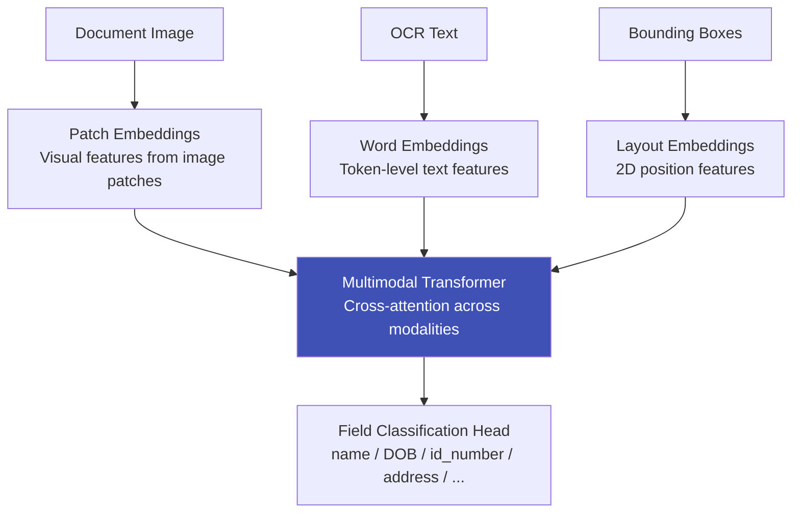

# Document Understanding Models

## Definition

**Document understanding models** go beyond OCR — they jointly process text, visual layout, and image features to extract structured data from documents. Instead of detecting text, reading it, then mapping fields separately, these models understand the entire document holistically.

---

## Key Models

| Model | Year | Architecture | Key Innovation |
|-------|------|-------------|----------------|
| **LayoutLM** | 2020 | BERT + 2D position embeddings | First to combine text + layout |
| **LayoutLMv2** | 2021 | Multimodal (text + layout + image) | Added visual features from image |
| **LayoutLMv3** | 2022 | Unified multimodal pretraining | Unified text-image pretraining, no CNN needed |
| **LiLT** | 2022 | Language-Independent Layout Transformer | Layout knowledge transfers across languages |
| **Donut** | 2022 | Swin Transformer → BART decoder | End-to-end: image → JSON, no separate OCR |
| **DocFormer** | 2021 | Multi-modal transformer | Shared positional encoding across modalities |
| **UDOP** | 2023 | Unified Document Processing | Single model for all document tasks |

---

## LayoutLMv3 (Most Used in eKYC)

### LayoutLMv3 for eKYC

| Aspect | Details |
|--------|---------|
| **Input** | Document image + OCR text + bounding boxes |
| **Training** | Pre-trained on 11M documents, fine-tune on ID-specific data |
| **Output** | Token-level labels: which text belongs to which field |
| **Languages** | Works across languages (pre-trained on multilingual data) |
| **Accuracy** | 95%+ field extraction accuracy on standard ID cards |
| **Speed** | 50-200ms per document (GPU) |

## Donut (OCR-Free Alternative)

| Advantage | Disadvantage |
|-----------|-------------|
| No separate OCR needed | Requires large training data |
| End-to-end trainable | Slower than LayoutLMv3 + dedicated OCR |
| Naturally handles complex layouts | Less interpretable (no intermediate OCR output) |

---

## Key Takeaways

!!! success "Summary"
    - **LayoutLMv3** is the standard for document field extraction — multimodal (text + layout + image)
    - **LiLT** is ideal for multilingual eKYC — layout knowledge transfers across languages
    - **Donut** offers an OCR-free alternative — image directly to structured JSON
    - These models **replace template-based extraction** for diverse document types
    - Fine-tuning on ID-specific data is essential — general document models need adaptation

---

## Related Articles

- [OCR Pipeline for ID Documents](ocr-pipeline-id-documents.md)
- [Multi-Language OCR](multi-language-ocr.md)
