# 📄 Document Verification

## Extracting Identity from Physical Documents

This section covers every aspect of **identity document processing** in eKYC — from capturing and classifying documents, to OCR extraction, forensic analysis, liveness detection, and security feature validation. Document verification is the complement to face biometrics: while face verification answers "is this the right person?", document verification answers "is this a real, unaltered document?"

---

## Articles in This Section

### Document Capture & Classification
| # | Article | What You'll Learn |
|---|---------|-------------------|
| 1 | [Document Capture & Quality](document-capture-quality.md) | Auto-capture, quality checks, camera guidance |
| 2 | [Document Classification](document-classification.md) | CNN/ViT models to identify document type from 6000+ classes |
| 3 | [ID Document Types Worldwide](id-document-types-worldwide.md) | Passports, national IDs, driving licenses — global diversity |

### OCR & Data Extraction
| # | Article | What You'll Learn |
|---|---------|-------------------|
| 4 | [OCR Pipeline for ID Documents](ocr-pipeline-id-documents.md) | End-to-end: detection → recognition → field mapping |
| 5 | [Text Detection Models](text-detection-models.md) | CRAFT, EAST, DBNet — locating text regions |
| 6 | [Text Recognition Models](text-recognition-models.md) | CRNN, TrOCR, PaddleOCR — reading detected text |
| 7 | [Document Understanding Models](document-understanding-models.md) | LayoutLMv3, LiLT, Donut — structured extraction |
| 8 | [MRZ Parsing](mrz-parsing.md) | Machine Readable Zone on passports and travel documents |
| 9 | [Barcode & QR Code Reading](barcode-qr-reading.md) | PDF417, QR codes on IDs — parsing encoded data |

### Document Security & Forensics
| # | Article | What You'll Learn |
|---|---------|-------------------|
| 10 | [Document Forensics Overview](document-forensics-overview.md) | Detecting tampering, forgery, and alteration |
| 11 | [Digital Tampering Detection](digital-tampering-detection.md) | ELA, noise analysis, copy-move, splicing detection |
| 12 | [Document Liveness](document-liveness.md) | Detecting screen display, photocopies, printed photos of documents |
| 13 | [Security Feature Validation](security-feature-validation.md) | Holograms, UV features, microprint, watermarks |
| 14 | [NFC Chip Reading](nfc-chip-reading.md) | Reading ePassport/eID chips — BAC, PACE, Active Authentication |

### Advanced Topics
| # | Article | What You'll Learn |
|---|---------|-------------------|
| 15 | [Document Data Verification](document-data-verification.md) | Cross-checking extracted data against government databases |
| 16 | [Address Verification](address-verification.md) | Utility bills, bank statements — proof of address processing |
| 17 | [Multi-Language OCR](multi-language-ocr.md) | Arabic, Chinese, Devanagari, Cyrillic — script-specific challenges |
| 18 | [Synthetic Document Detection](synthetic-document-detection.md) | Detecting AI-generated fake IDs |
| 19 | [Document Processing at Scale](document-processing-at-scale.md) | GPU batching, async pipelines, handling millions/day |
| 20 | [Document Verification Vendors](document-verification-vendors.md) | Microblink, Regula, ABBYY, cloud AI services |

---

## Document Verification Pipeline

```mermaid
graph TD
    A[Camera/Upload] --> B[Auto-Capture<br/>Quality checks]
    B --> C[Classification<br/>What type of document?]
    C --> D[Parallel Processing]

    D --> E[OCR Pipeline<br/>Text detection → recognition → field mapping]
    D --> F[Forensic Analysis<br/>Tampering, copy-move, splicing]
    D --> G[Document Liveness<br/>Screen/photocopy detection]
    D --> H[Security Features<br/>Hologram, MRZ, barcode, NFC]
    D --> I[Face Extraction<br/>Photo on document]

    E --> J[Structured Data<br/>Name, DOB, ID number, address]
    F --> K[Authenticity Score]
    G --> L[Liveness Score]
    H --> M[Security Feature Score]
    I --> N[Face for matching]

    J & K & L & M --> O[Document Decision<br/>Accept / Review / Reject]
    N --> P[Face Matching Pipeline]

    style D fill:#4051B5,color:#fff
    style O fill:#2E7D32,color:#fff
```

---

!!! tip "For Document AI Engineers"
    Start with **OCR Pipeline** for the core extraction flow, then **Document Understanding Models** for the latest approaches. **Document Forensics** and **Document Liveness** are the security-critical components.
