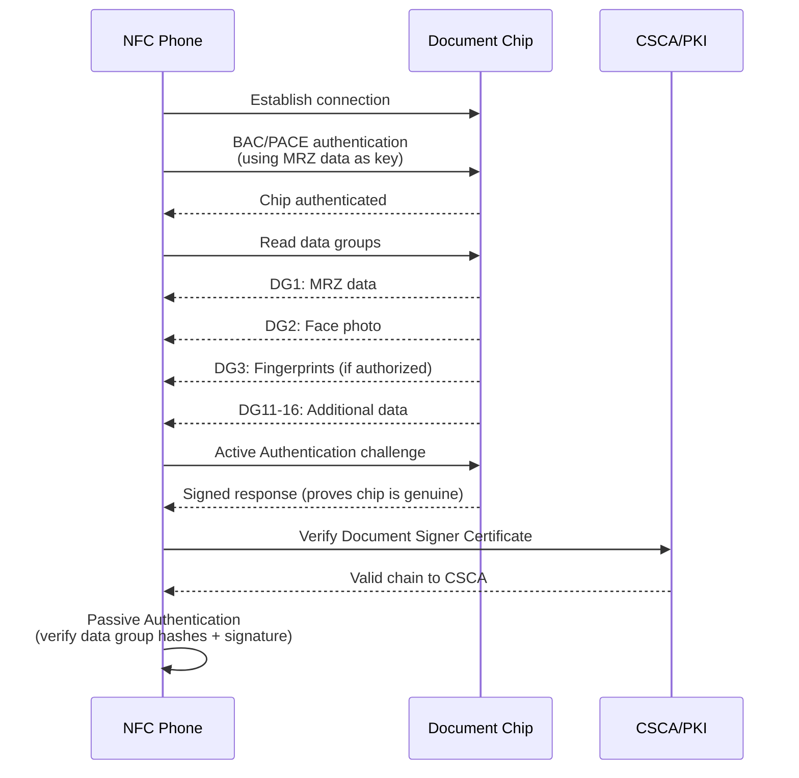

# NFC Chip Reading

## Definition

**NFC (Near Field Communication) chip reading** extracts cryptographically signed data from the electronic chips embedded in ePassports, eIDs, and some driving licenses. This is the **highest assurance** document verification method — the chip data is digitally signed by the issuing government and cannot be altered without detection.

---

## How It Works

---

## Data Groups on Chip

| Data Group | Content | Access |
|-----------|---------|--------|
| **DG1** | MRZ data (same as printed) | Basic access |
| **DG2** | Face photograph (high quality) | Basic access |
| **DG3** | Fingerprint templates | Extended access (government only) |
| **DG7** | Signature/handwriting image | Basic access |
| **DG11** | Additional personal details | Basic access |
| **DG14** | Security info for chip authentication | Basic access |
| **SOD** | Document Security Object — digital signature | Basic access |

## Authentication Types

| Type | What It Proves | Method |
|------|---------------|--------|
| **Passive Authentication** | Data hasn't been altered | Verify digital signature on SOD against PKI |
| **Active Authentication** | Chip is genuine (not cloned) | Challenge-response with chip's private key |
| **BAC** | Reader is authorized (basic) | Derive key from MRZ data |
| **PACE** | Reader is authorized (modern) | Password-based key agreement |
| **Chip Authentication** | Chip is genuine (alternative to AA) | Diffie-Hellman key agreement |

---

## NFC in eKYC

| Advantage | Details |
|-----------|---------|
| **Highest assurance** | Government-signed data — cryptographically tamper-proof |
| **High-quality photo** | DG2 face photo is better than camera capture of printed photo |
| **No OCR errors** | Data comes digitally — no recognition errors |
| **Anti-counterfeit** | Active authentication proves chip is genuine |

| Challenge | Details |
|-----------|---------|
| **Not all documents have chips** | Only ePassports and newer eIDs |
| **NFC reader required** | Most modern phones have NFC, but not all |
| **User experience** | Must hold phone against document — positioning can be tricky |
| **BAC key derivation** | Need MRZ data first to access chip — requires OCR step |

---

## Key Takeaways

!!! success "Summary"
    - NFC chip reading provides the **highest assurance** document verification — cryptographically signed by government
    - **Passive authentication** verifies data integrity; **Active authentication** proves chip is genuine
    - DG2 provides a **high-quality face photo** — better for face matching than camera-captured ID photo
    - **Not universal** — only ePassports and newer eIDs have chips
    - NFC is becoming the **gold standard** for eKYC document verification where available

---

## Related Articles

- [MRZ Parsing](mrz-parsing.md)
- [Security Feature Validation](security-feature-validation.md)
- [Document Data Verification](document-data-verification.md)
