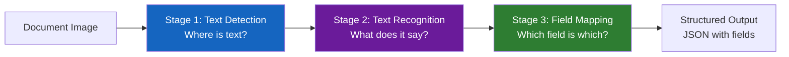
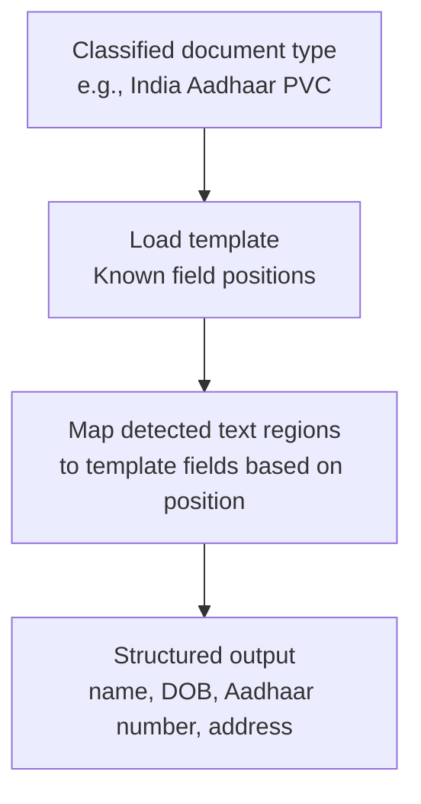

# OCR Pipeline for ID Documents

## Definition

The **OCR (Optical Character Recognition) pipeline** for identity documents transforms a captured document image into structured data — extracting fields like name, date of birth, document number, address, and expiry date with high accuracy.

---

## The Three-Stage Pipeline



---

## Stage 1: Text Detection

Locating text regions in the document image:

| Model | Architecture | Key Feature | Speed |
|-------|-------------|-------------|-------|
| **CRAFT** | VGG-16 + affinity | Character-level detection, handles curved text | 30-50ms |
| **EAST** | PVANet + geometry | Fast, compact — good for real-time | 10-20ms |
| **DBNet** | ResNet + differentiable binarization | Adaptive thresholding, state-of-the-art | 20-40ms |
| **DBNet++** | DBNet + adaptive scale fusion | Improved multi-scale detection | 25-45ms |
| **PSENet** | Progressive scale expansion | Handles closely spaced text well | 30-50ms |

### Detection Output

For each text region: polygon coordinates (4+ points) enclosing the text.

---

## Stage 2: Text Recognition

Reading the detected text regions:

| Model | Architecture | Key Feature | Accuracy |
|-------|-------------|-------------|----------|
| **CRNN** | CNN + BiLSTM + CTC | Classic, fast, reliable | 95-98% (printed) |
| **TrOCR** | ViT encoder + GPT decoder | Transformer-based, high accuracy | 98-99% (printed) |
| **PaddleOCR PP-OCRv4** | Lightweight CNN + SVTR | Fast, multilingual, mobile-ready | 97-99% |
| **SVTR** | Scene text ViT | Single visual model, no RNN | 97-99% |
| **ABINet** | Autonomous, Bidirectional, Iterative | Language model correction built-in | 98-99% |

### Recognition Accuracy by Content Type

| Content Type | Typical Accuracy | Challenge |
|-------------|-----------------|-----------|
| **Printed Latin text** | 98-99.5% | Standard, well-solved |
| **Printed non-Latin** | 95-99% | Script-dependent (Arabic harder than Chinese) |
| **Handwritten text** | 70-90% | Highly variable, personal style |
| **Numbers/dates** | 99%+ | Constrained vocabulary helps |
| **MRZ (OCR-B font)** | 99.5%+ | Fixed font designed for OCR |
| **Damaged/faded text** | 60-85% | Enhancement helps but limits exist |

---

## Stage 3: Field Mapping

Assigning recognized text to semantic fields:

### Approach 1: Template-Based



- **Pros**: Fast, reliable for known templates
- **Cons**: Breaks if document layout varies, requires template per document variant

### Approach 2: Document Understanding Models

| Model | Architecture | Key Innovation |
|-------|-------------|----------------|
| **LayoutLMv3** | Multimodal Transformer (text + layout + image) | Pre-trained on document understanding |
| **LiLT** | Language-Independent Layout Transformer | Layout knowledge transfers across languages |
| **Donut** | End-to-end (no separate OCR needed) | Image → JSON directly |
| **DocFormer** | Multi-modal transformer | Combines text, visual, and spatial features |
| **UDOP** | Unified Document Processing | Single model for all document tasks |

**LayoutLMv3** is the most widely used:

```
Input: Document image + OCR text + bounding box positions
→ Multimodal transformer processes all modalities jointly
→ Output: Field labels for each text region (name, DOB, id_number, etc.)
```

### Approach 3: Hybrid

Template-based for known high-volume documents (Aadhaar, passport) + ML model for long-tail/unknown documents.

---

## Post-Processing & Validation

| Step | What It Does | Example |
|------|-------------|---------|
| **Date normalization** | Convert various date formats to ISO 8601 | "12/03/1990" → "1990-03-12" |
| **Name cleaning** | Remove artifacts, fix spacing | "J O H N DOE" → "JOHN DOE" |
| **Number validation** | Check digit validation for ID numbers | Aadhaar: Verhoeff checksum |
| **Cross-field validation** | DOB on front matches MRZ DOB | Catch OCR errors |
| **MRZ validation** | Check digits in MRZ (ICAO 9303) | Mathematically verify MRZ integrity |
| **Confidence scoring** | Per-field confidence based on recognition score | Flag low-confidence fields for review |

---

## End-to-End Performance

| Metric | Target | Typical Achievement |
|--------|--------|-------------------|
| **Field-level accuracy** | > 95% | 96-99% (printed modern docs) |
| **Document-level accuracy** | > 90% (all fields correct) | 90-95% |
| **Processing time** | < 3 seconds | 1-3 sec (GPU server) |
| **First-attempt success** | > 85% | 80-90% |

---

## Key Takeaways

!!! success "Summary"
    - OCR pipeline has **3 stages**: text detection (CRAFT/DBNet) → recognition (CRNN/TrOCR) → field mapping (LayoutLMv3/template)
    - **LayoutLMv3** is the state-of-the-art for field extraction — combines text, layout, and image understanding
    - **Printed text**: 98-99% accuracy; **handwritten**: 70-90%; **damaged**: 60-85%
    - **Post-processing validation** (checksums, cross-field checks) catches remaining OCR errors
    - **Hybrid approach** works best: templates for known documents + ML for unknown/edge cases

---

## Related Articles

- **Previous**: [← ID Document Types Worldwide](id-document-types-worldwide.md)
- **Next**: [Text Detection Models →](text-detection-models.md)
- [Document Understanding Models](document-understanding-models.md)
- [MRZ Parsing](mrz-parsing.md)
