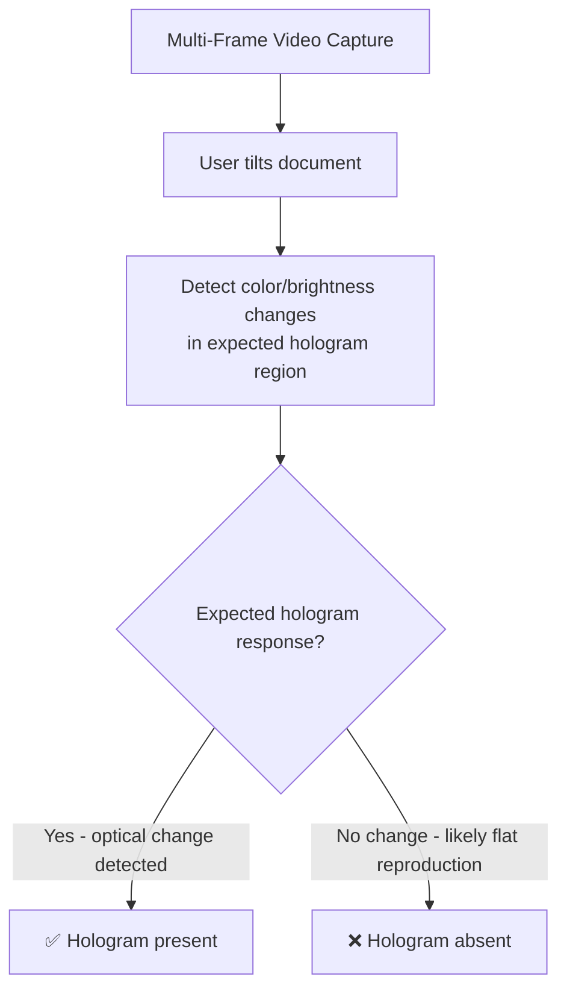

# Security Feature Validation

## Definition

Modern identity documents contain multiple **physical and digital security features** — holograms, UV patterns, microprint, watermarks, and NFC chips. Validating these features confirms the document is a genuine government-issued original.

---

## Security Feature Types

| Feature | What It Is | Verifiable via Camera? |
|---------|-----------|----------------------|
| **Hologram/OVD** | Optically variable device that changes appearance with viewing angle | Partially — multi-frame video capture |
| **UV features** | Patterns visible only under ultraviolet light | No — requires UV light source |
| **Microprint** | Extremely small text visible only under magnification | Partially — high-res camera |
| **Watermark** | Pattern embedded in document material | Partially — with backlighting |
| **Intaglio printing** | Raised ink detectable by touch | No — requires physical inspection |
| **Laser perforation** | Micro-holes forming patterns | Partially — with backlighting |
| **Security thread** | Embedded metallic thread | Partially — with close-up |
| **Color-shifting ink** | Ink that changes color with viewing angle | Yes — multi-frame capture |
| **NFC chip** | Cryptographically signed digital data | Yes — NFC-enabled phone |

## Hologram Detection via Camera

---

## Key Takeaways

!!! success "Summary"
    - Most security features **cannot be fully verified** through a phone camera alone
    - **Holograms** can be partially verified by detecting optical variability in multi-frame video
    - **NFC chips** provide the strongest remote verification — cryptographically signed data
    - Phone-based eKYC relies primarily on **document forensics + document liveness** rather than physical security features
    - **V-KYC agents** can instruct users to tilt documents for hologram verification

---

## Related Articles

- [NFC Chip Reading](nfc-chip-reading.md)
- [Document Forensics Overview](document-forensics-overview.md)
