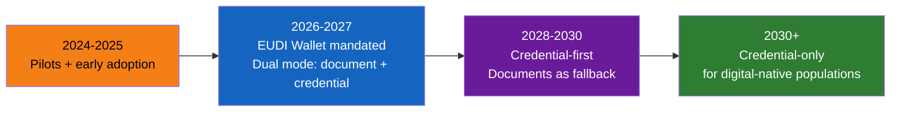

# How Digital Identity Changes eKYC

## Definition

This article analyzes how the transition to digital identity — verifiable credentials, wallets, and government APIs — will reshape the eKYC industry, what technology becomes obsolete, and what new opportunities emerge.

---

## What Disappears vs What Remains

| eKYC Component | Impact of Digital Identity |
|---------------|--------------------------|
| **Document capture** | ⬇️ Reduced — credentials presented digitally |
| **OCR / text extraction** | ⬇️ Eliminated — structured data from credential |
| **Document classification** | ⬇️ Eliminated — credential type is metadata |
| **Document forensics** | ⬇️ Reduced — cryptographic verification replaces forensic analysis |
| **Face matching (doc vs selfie)** | ⬇️ Reduced — biometric bound to credential |
| **Face liveness** | ➡️ Remains — still needed to prove holder is present |
| **Sanctions/PEP screening** | ➡️ Remains — still required by regulation |
| **Risk assessment** | ➡️ Remains — risk-based approach still mandatory |
| **Ongoing monitoring** | ➡️ Remains — AML/KYT obligations unchanged |
| **Credential verification** | ⬆️ New — verify issuer signatures, check revocation |
| **Wallet integration** | ⬆️ New — accept credentials from EUDI/other wallets |
| **Credential issuance** | ⬆️ New — issue verified credentials after KYC |

---

## Transition Timeline

---

## Strategic Implications for eKYC Providers

| Opportunity | Details |
|-------------|---------|
| **Credential verification** | New service: verify EUDI/VC credentials for clients |
| **Credential issuance** | After completing KYC, issue reusable credential to customer |
| **Wallet infrastructure** | Build/operate wallet systems for governments or enterprises |
| **Orchestration** | Route between document eKYC and credential eKYC based on availability |
| **Compliance layer** | Screening (sanctions, PEP, adverse media) remains regardless of identity method |

| Risk | Details |
|------|---------|
| **Disintermediation** | If government provides identity directly, middleware value decreases |
| **Revenue compression** | Credential verification is cheaper than document processing |
| **Skill shift** | Cryptography + protocol expertise vs computer vision + OCR |

---

## Key Takeaways

!!! success "Summary"
    - Digital identity will **gradually replace** document-centric eKYC — but the transition takes 5-10+ years
    - **Face liveness remains essential** — proving the credential holder is present
    - **Screening (sanctions, PEP, AML)** is unaffected — still required by law
    - New opportunities: **credential issuance, wallet infrastructure, orchestration**
    - New risk: **disintermediation** if governments provide identity directly to institutions
    - Smart eKYC providers will **offer both** document and credential verification paths

---

## Related Articles

- [Digital Identity Overview](digital-identity-overview.md)
- [eIDAS & EU Digital Identity](eidas-eu-digital-identity.md)
- [eKYC Future Trends](../00-foundations/ekyc-future-trends.md)
