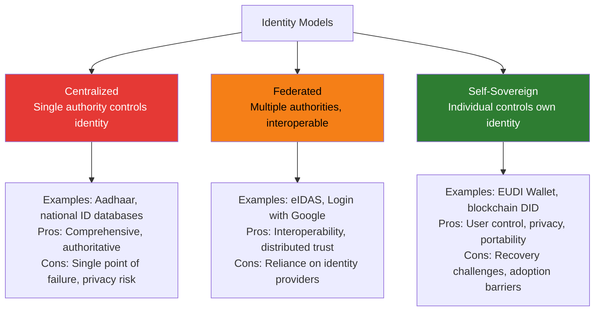

# Digital Identity Overview

## Definition

**Digital identity** is a set of electronically captured and stored attributes that uniquely describe a person within a given context. Unlike physical identity documents, digital identity can be verified cryptographically, shared selectively, and updated in real-time.

---

## Identity Models

---

## Evolution of Digital Identity

| Era | Model | Example | User Control |
|-----|-------|---------|-------------|
| **1990s** | Username + password | Email accounts | Minimal |
| **2000s** | Federated login | SAML, OpenID | Limited |
| **2010s** | Social login + mobile | Login with Google/Facebook | Low (platform controls) |
| **2015+** | Government digital ID | Aadhaar, Singpass, eID | Medium (government controls) |
| **2020+** | Verifiable credentials | W3C VCs, EUDI Wallet | High (user holds credentials) |
| **2025+** | Self-sovereign identity | DID + VC + wallet | Full (user controls everything) |

---

## Digital Identity Components

| Component | What It Is | Example |
|-----------|-----------|---------|
| **Identifier** | Unique reference for the person | Aadhaar number, DID, email |
| **Credentials** | Verified claims about the person | Age > 18, name = "John", citizen of India |
| **Authentication** | Proof that the person is who they claim | Biometric, OTP, cryptographic signature |
| **Wallet** | Where credentials are stored and managed | EUDI Wallet, phone app |
| **Trust framework** | Rules governing who can issue, verify, and accept credentials | eIDAS, FATF guidance |

---

## Digital Identity for eKYC

| Current eKYC | Digital Identity eKYC |
|-------------|----------------------|
| Capture physical document | Receive digital credential |
| OCR to extract text | Structured data already available |
| Face match with ID photo | Biometric bound to credential |
| Database verification API | Cryptographic signature verification |
| Store document copies | Store verification proof (no PII needed) |
| Re-verify periodically | Credential auto-refreshes or re-issues |

---

## Key Takeaways

!!! success "Summary"
    - Digital identity is evolving from **centralized** (governments control) to **self-sovereign** (individuals control)
    - **Verifiable credentials** are the technical foundation — cryptographically signed claims
    - For eKYC, digital identity means: **no document capture, no OCR, no face matching** — just credential verification
    - **EUDI Wallet** (EU, 2026-2027) and **India Stack** are the two largest implementations
    - The transition will be gradual — physical documents and digital credentials will **coexist for years**

---

## Related Articles

- **Next**: [Identity Assurance Levels →](identity-assurance-levels.md)
- [eIDAS & EU Digital Identity](eidas-eu-digital-identity.md)
- [India Stack](india-stack.md)
- [How Digital Identity Changes eKYC](digital-identity-impact-ekyc.md)
