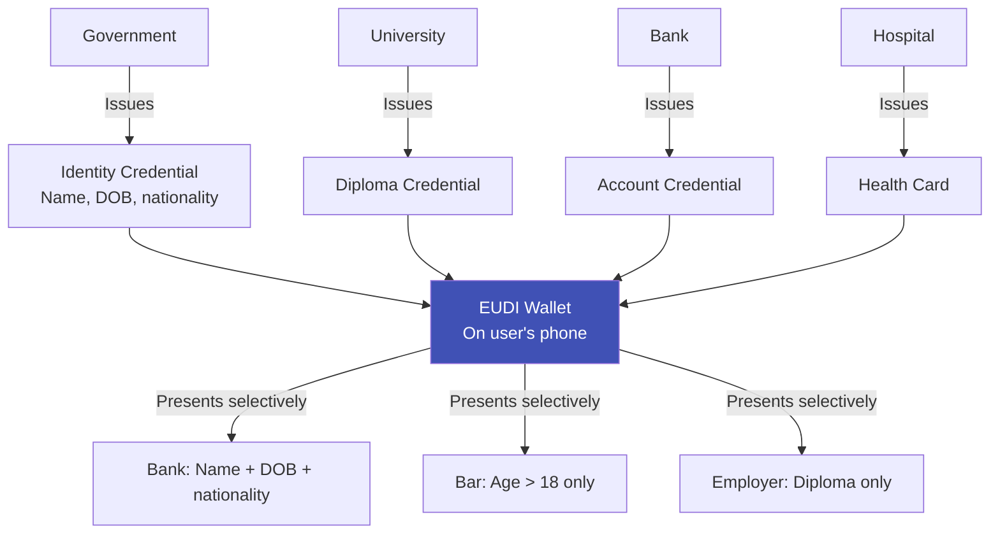

# eIDAS & EU Digital Identity

## Definition

**eIDAS (Electronic Identification, Authentication and Trust Services)** is the EU regulation establishing a legal framework for electronic identification and trust services. **eIDAS 2.0** (2024) introduces the **EU Digital Identity Wallet (EUDI Wallet)** — the most ambitious digital identity initiative globally.

---

## eIDAS 1.0 (2014) → eIDAS 2.0 (2024)

| Aspect | eIDAS 1.0 (2014) | eIDAS 2.0 (2024) |
|--------|------------------|-------------------|
| **Scope** | Mutual recognition of national eIDs | Universal digital identity wallet for all EU citizens |
| **Coverage** | Government services only | Government + private sector (banks, telecom, health) |
| **Wallet** | No wallet concept | EUDI Wallet mandatory for all member states |
| **Users** | Limited adoption | Target: 450M EU citizens by 2026-2027 |
| **Selective disclosure** | No | Yes — prove age without revealing DOB |
| **Cross-border** | Limited interoperability | Full cross-border recognition |

---

## EU Digital Identity Wallet (EUDI Wallet)

### Key Features

| Feature | Details |
|---------|---------|
| **Mandatory** | All EU member states must offer EUDI Wallet by 2026-2027 |
| **Acceptance required** | Large platforms, banks, telecom must accept wallet for identity |
| **Selective disclosure** | Share only what's needed (e.g., "over 18" without revealing exact DOB) |
| **Cross-border** | French wallet works in German bank, Spanish university, etc. |
| **User control** | User decides what to share, with whom, and can revoke |
| **Free for citizens** | Wallet app provided free by member states |
| **Standards** | Based on W3C Verifiable Credentials, ISO 18013-5 (mDL) |

---

## Impact on eKYC

| Current eKYC in EU | With EUDI Wallet |
|-------------------|------------------|
| Capture passport/ID → OCR → face match → DB check | User presents identity credential from wallet |
| 30-60 seconds, error-prone | 2-5 seconds, cryptographically verified |
| Store document copies (GDPR headache) | Store verification proof only (no PII) |
| Different process per country | Standardized across all 27 EU states |

---

## Key Takeaways

!!! success "Summary"
    - **eIDAS 2.0** mandates EU Digital Identity Wallet for **450M citizens by 2026-2027**
    - Banks, telecom, and large platforms **must accept** the wallet for identity verification
    - **Selective disclosure** (prove age without DOB) is a game-changer for privacy
    - For eKYC: document capture + OCR + face matching **partially replaced** by wallet credential verification
    - eKYC providers must **add wallet credential verification** to their capabilities

---

## Related Articles

- [W3C Verifiable Credentials](w3c-verifiable-credentials.md)
- [Identity Wallets](identity-wallets.md)
- [How Digital Identity Changes eKYC](digital-identity-impact-ekyc.md)
