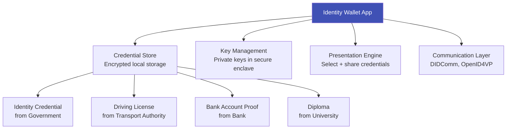

# Identity Wallets

## Definition

An **identity wallet** is a software application (typically mobile) where individuals store, manage, and present their digital identity credentials — like a physical wallet but for verified digital claims.

---

## Wallet Architecture

## Major Wallet Implementations

| Wallet | Region | Status | Key Feature |
|--------|--------|--------|-------------|
| **EUDI Wallet** | EU (27 states) | Pilots 2024-2025, mandatory 2026-2027 | Cross-border, selective disclosure |
| **India DigiLocker** | India | Live (200M+ users) | Government document storage (not full SSI) |
| **BC Wallet** | British Columbia, Canada | Pilot | Hyperledger Aries-based |
| **ID Wallet** | Germany | Pilot | German eID integration |
| **NSW Digital ID** | Australia (NSW) | Live | State government credentials |

---

## Wallet Security Requirements

| Requirement | Implementation |
|-------------|---------------|
| **Key protection** | Private keys in hardware secure enclave (TEE/SE) |
| **Biometric binding** | Wallet unlocked only with owner's biometric |
| **Credential encryption** | AES-256 at rest |
| **Backup/recovery** | Secure cloud backup with user-controlled encryption |
| **Tamper detection** | App integrity checks, root/jailbreak detection |
| **Selective disclosure** | ZKP or SD-JWT for minimal data sharing |

---

## Key Takeaways

!!! success "Summary"
    - Identity wallets are the **user-facing component** of digital identity — store and present credentials
    - **EUDI Wallet** is the most important for eKYC — 450M potential users, banks must accept
    - **DigiLocker** (India) is the largest existing implementation — but stores documents, not verifiable credentials
    - Wallet security relies on **hardware secure enclaves** for key protection + biometric binding
    - For eKYC providers: must add **wallet credential acceptance** alongside document verification

---

## Related Articles

- [eIDAS & EU Digital Identity](eidas-eu-digital-identity.md)
- [Self-Sovereign Identity](self-sovereign-identity.md)
- [India Stack](india-stack.md)
