# 🌐 Digital Identity

## The Future of Identity — Beyond Documents

This section covers the **emerging paradigm of digital identity** — where identity moves from physical documents to cryptographic credentials, from centralized databases to decentralized wallets, and from "verify every time" to "verify once, prove everywhere."

---

## Articles in This Section

### Foundations of Digital Identity
| # | Article | What You'll Learn |
|---|---------|-------------------|
| 1 | [Digital Identity Overview](digital-identity-overview.md) | What digital identity means, models, evolution |
| 2 | [Identity Assurance Levels](identity-assurance-levels.md) | NIST SP 800-63, eIDAS LoA, assurance frameworks |
| 3 | [Reusable KYC / Portable Identity](reusable-kyc.md) | Verify once, use everywhere — models and implementations |

### Standards & Frameworks
| # | Article | What You'll Learn |
|---|---------|-------------------|
| 4 | [eIDAS & EU Digital Identity](eidas-eu-digital-identity.md) | eIDAS 1.0, eIDAS 2.0, EUDI Wallet |
| 5 | [W3C Verifiable Credentials](w3c-verifiable-credentials.md) | VC data model, issuance, verification, selective disclosure |
| 6 | [Decentralized Identifiers (DIDs)](decentralized-identifiers.md) | DID methods, resolution, relationship to VCs |

### Self-Sovereign Identity
| # | Article | What You'll Learn |
|---|---------|-------------------|
| 7 | [Self-Sovereign Identity (SSI)](self-sovereign-identity.md) | Principles, architecture, user-controlled identity |
| 8 | [Identity Wallets](identity-wallets.md) | EUDI Wallet, mobile wallets, credential storage |

### National Digital Identity Systems
| # | Article | What You'll Learn |
|---|---------|-------------------|
| 9 | [India Stack (Aadhaar + UPI + DigiLocker)](india-stack.md) | The world's largest digital identity infrastructure |
| 10 | [Singapore Singpass / MyInfo](singapore-singpass-myinfo.md) | Government-verified data auto-fill |
| 11 | [Estonia e-Residency](estonia-e-residency.md) | The world's most advanced digital government |

### Impact on eKYC
| # | Article | What You'll Learn |
|---|---------|-------------------|
| 12 | [How Digital Identity Changes eKYC](digital-identity-impact-ekyc.md) | What disappears, what emerges, transition path |

---

## The Paradigm Shift

```mermaid
graph LR
    subgraph "Current: Document-Centric eKYC"
        A[Physical Document] --> B[Capture + OCR]
        B --> C[Face Match]
        C --> D[Database Check]
        D --> E[Verified ✅]
    end

    subgraph "Future: Credential-Based eKYC"
        F[Digital Wallet] --> G[Present Credential]
        G --> H[Verify Signature]
        H --> I[Verified ✅]
    end

    style E fill:#F57F17,color:#000
    style I fill:#2E7D32,color:#fff
```

**Today**: Capture document → OCR → Face match → Database verify (30-60 seconds, error-prone)

**Tomorrow**: Present verifiable credential → Cryptographic verification (2-5 seconds, mathematically certain)
