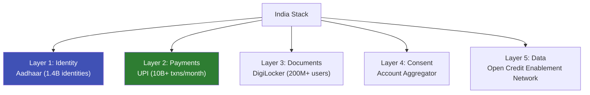
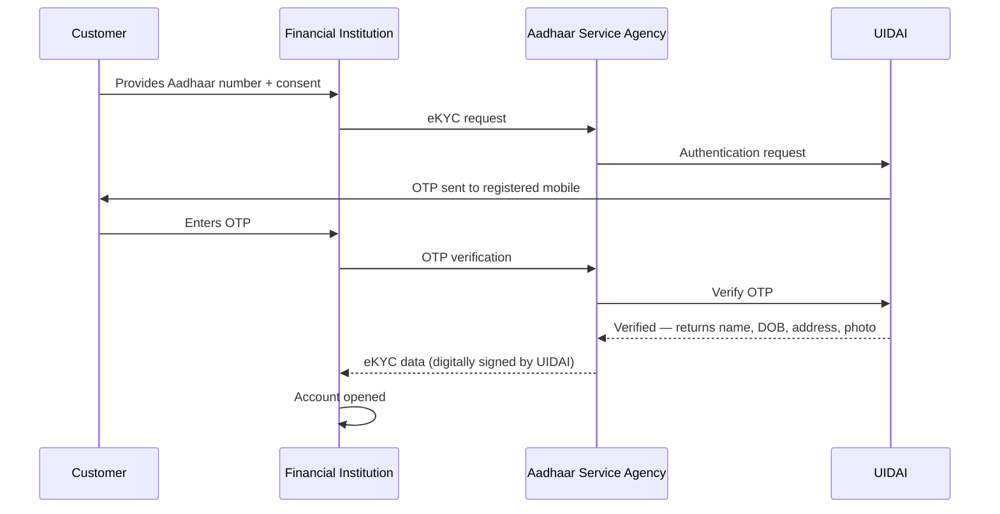

# India Stack (Aadhaar + UPI + DigiLocker)

## Definition

**India Stack** is the world's largest digital public infrastructure — a set of open APIs built on Aadhaar identity, UPI payments, and DigiLocker document storage that enables digital identity, payments, and document verification at population scale.

---

## India Stack Layers

## Aadhaar for eKYC

| Feature | Details |
|---------|---------|
| **Coverage** | 1.4 billion identities (99%+ of adult population) |
| **eKYC methods** | OTP-based, biometric (fingerprint/iris), offline XML, face authentication |
| **Volume** | 100M+ eKYC transactions per month |
| **Cost** | ₹3-20 per verification ($0.04-0.25) |
| **Speed** | < 5 seconds for OTP-based |
| **Operator** | UIDAI (Unique Identification Authority of India) |

## eKYC Flow via Aadhaar

## DigiLocker

| Feature | Details |
|---------|---------|
| **Users** | 200M+ registered |
| **Documents** | Aadhaar, PAN, DL, vehicle registration, mark sheets, degrees |
| **Issuers** | 2,500+ organizations |
| **Legal validity** | Documents from DigiLocker are legally equivalent to originals (IT Act Section 9) |

---

## India Stack's Global Influence

Countries studying/replicating the India Stack model:
- **Philippines** (PhilSys modeled on Aadhaar)
- **Ethiopia** (Fayda national ID)
- **Morocco, Sri Lanka, Nigeria** (exploring similar architectures)

---

## Key Takeaways

!!! success "Summary"
    - India Stack is the **world's largest digital identity infrastructure** — 1.4B identities, 100M+ eKYC/month
    - **Aadhaar eKYC** is the cheapest ($0.04-0.25) and fastest (< 5 seconds) verification globally
    - **DigiLocker** provides legally valid digital documents — reducing need for physical document capture
    - The stack is being **replicated globally** as a model for digital public infrastructure
    - For eKYC in India: Aadhaar-based verification is the **dominant method** used by banks and fintechs

---

## Related Articles

- [eKYC Global Adoption](../00-foundations/ekyc-global-adoption.md)
- [Central KYC (cKYC)](../01-identity-verification/ckyc-central-kyc.md)
- [Singapore Singpass / MyInfo](singapore-singpass-myinfo.md)
