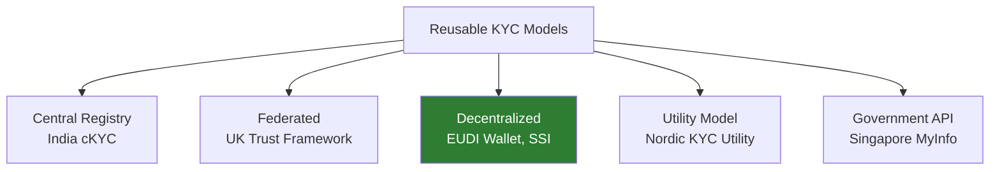

# Reusable KYC / Portable Identity

## Definition

**Reusable KYC** enables a customer to complete identity verification once at a trusted provider and then reuse that verified identity at other institutions — eliminating repeated document capture, selfie verification, and database checks.

---

## Models

| Model | How It Works | Example |
|-------|-------------|---------|
| **Central registry** | KYC data stored centrally, institutions download | India cKYC (CERSAI) |
| **Federated** | Trusted IdPs issue verified identity, accepted by relying parties | UK Digital Identity Trust Framework |
| **Decentralized** | User holds verifiable credentials in wallet, presents to anyone | EUDI Wallet, Hyperledger Aries |
| **Utility** | Consortium of banks shares KYC data | Nordic KYC Utility |
| **Government API** | Government provides verified data on demand | Singapore MyInfo |

---

## Benefits

| Stakeholder | Benefit |
|-------------|---------|
| **Customer** | Verify once, no repeated document submission |
| **Institution** | Lower onboarding cost, higher conversion |
| **Regulator** | Consistent KYC quality, centralized oversight |
| **eKYC provider** | New revenue: credential issuance, wallet infrastructure |

## Challenges

| Challenge | Details |
|-----------|---------|
| **Data freshness** | How current is the reused KYC? |
| **Liability** | Who's liable if reused KYC misses something? |
| **Interoperability** | Different standards, formats, trust frameworks |
| **Privacy** | Centralized models create privacy risks |
| **Adoption** | Requires critical mass of issuers and verifiers |

---

## Key Takeaways

!!! success "Summary"
    - Reusable KYC is the **end goal** of digital identity for eKYC — verify once, prove everywhere
    - **Multiple models exist**: centralized (India cKYC), federated (UK), decentralized (EU), government API (Singapore)
    - **EUDI Wallet** (decentralized) is the most ambitious — user-controlled, cross-border, selective disclosure
    - **Liability and data freshness** are the biggest unresolved challenges
    - For eKYC providers: the shift from document processing to **credential issuance and verification**

---

## Related Articles

- [Digital Identity Overview](digital-identity-overview.md)
- [Central KYC (cKYC)](../01-identity-verification/ckyc-central-kyc.md)
- [W3C Verifiable Credentials](w3c-verifiable-credentials.md)
