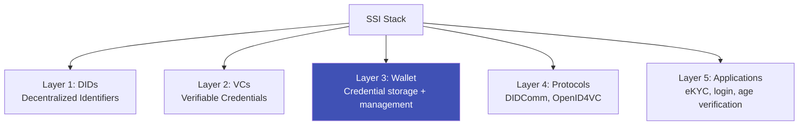

# Self-Sovereign Identity (SSI)

## Definition

**Self-Sovereign Identity (SSI)** is an identity model where individuals fully own and control their digital identity — deciding what information to share, with whom, and for how long — without depending on any central authority.

---

## SSI Principles (Christopher Allen, 2016)

| Principle | Meaning |
|-----------|---------|
| **Existence** | Users have an independent existence beyond digital |
| **Control** | Users control their identity data |
| **Access** | Users can access their own data |
| **Transparency** | Systems and algorithms must be transparent |
| **Persistence** | Identities must be long-lived |
| **Portability** | Identity must be transportable |
| **Interoperability** | Identities must work across systems |
| **Consent** | Users must consent to use of their data |
| **Minimization** | Only minimum necessary data is disclosed |
| **Protection** | User rights must be protected |

---

## SSI Architecture

## SSI vs Current Identity Models

| Aspect | Centralized (Aadhaar) | Federated (Google Login) | SSI |
|--------|----------------------|------------------------|-----|
| **Data stored by** | Government | Identity provider | User's device |
| **User control** | Limited | Limited | Full |
| **Privacy** | Government sees all usage | IdP sees all usage | Verifier sees only what's shared |
| **Single point of failure** | Yes (central DB) | Yes (IdP outage) | No |
| **Revocation** | By authority | By provider | By user |

---

## Key Takeaways

!!! success "Summary"
    - SSI puts **individuals in control** of their identity — a fundamental shift from centralized models
    - Built on **DIDs + VCs + Wallets** as the technical stack
    - EUDI Wallet is the **largest SSI-adjacent implementation** coming to production
    - **Challenges**: recovery (lose phone = lose identity?), adoption, user experience
    - For eKYC: SSI means **the user presents credentials** rather than the institution verifying documents

---

## Related Articles

- [W3C Verifiable Credentials](w3c-verifiable-credentials.md)
- [Identity Wallets](identity-wallets.md)
- [Decentralized Identifiers](decentralized-identifiers.md)
