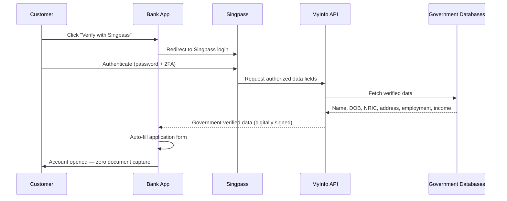

# Singapore Singpass / MyInfo

## Definition

**Singpass** is Singapore's national digital identity, and **MyInfo** is the government API that pre-fills verified personal data — enabling **zero-document eKYC** where the customer simply authorizes data sharing.

---

## How MyInfo Works for eKYC

## Key Stats

| Metric | Value |
|--------|-------|
| **Singpass users** | 4.5M+ (97% of residents 15+) |
| **MyInfo data fields** | 300+ (identity, income, employment, property, education) |
| **Transactions** | 40M+ annually |
| **Adoption** | 700+ government + private sector services |
| **eKYC time** | < 1 minute (no document capture) |

---

## Why Singapore's Model is Remarkable

| Feature | Impact |
|---------|--------|
| **Zero document capture** | No OCR, no photo upload, no face matching with document |
| **Government-verified data** | Data comes directly from government DB — highest assurance |
| **Pre-filled forms** | Customer doesn't even type their data |
| **Income/employment** | Bank gets IRAS-verified income — no payslip needed |
| **Consent-based** | Customer explicitly authorizes each data share |

---

## Key Takeaways

!!! success "Summary"
    - Singapore's Singpass/MyInfo achieves the **ideal eKYC**: zero documents, government-verified, 1 minute
    - **97% population coverage** makes it universal
    - **MyInfo provides 300+ data fields** — far beyond basic identity (income, employment, property)
    - This model is the **benchmark** for what digital identity-enabled eKYC can achieve
    - **Limitation**: requires comprehensive government digital infrastructure — not easily replicable everywhere

---

## Related Articles

- [India Stack](india-stack.md)
- [Estonia e-Residency](estonia-e-residency.md)
- [eKYC Global Adoption](../00-foundations/ekyc-global-adoption.md)
