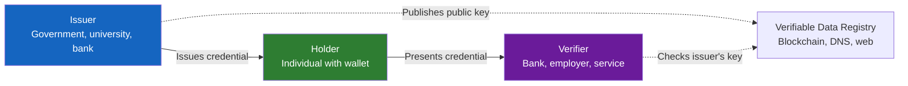

# W3C Verifiable Credentials

## Definition

**Verifiable Credentials (VCs)** are a W3C standard for expressing credentials (identity claims) in a way that is cryptographically verifiable, tamper-evident, and privacy-respecting. VCs are the technical building block of digital identity wallets.

---

## The Trust Triangle



1. **Issuer** creates and signs a credential (e.g., government signs "Name: John, DOB: 1990-01-15, Citizen: India")
2. **Holder** stores the credential in their wallet
3. **Verifier** checks the issuer's cryptographic signature — if valid, the credential is trusted

---

## VC Structure

```json
{
  "@context": ["https://www.w3.org/2018/credentials/v1"],
  "type": ["VerifiableCredential", "IdentityCredential"],
  "issuer": "did:web:government.example.com",
  "issuanceDate": "2024-01-15T00:00:00Z",
  "credentialSubject": {
    "id": "did:key:z6Mkf5rG...",
    "givenName": "John",
    "familyName": "Doe",
    "dateOfBirth": "1990-01-15",
    "nationality": "IN"
  },
  "proof": {
    "type": "Ed25519Signature2020",
    "verificationMethod": "did:web:government.example.com#key-1",
    "proofValue": "z58DAdFfa9..."
  }
}
```

---

## Selective Disclosure

VCs support **Zero-Knowledge Proofs (ZKPs)** and **SD-JWT** for selective disclosure:

| Scenario | What's Shared | What's Hidden |
|----------|-------------|---------------|
| **Age verification at bar** | "Over 18: true" | Name, DOB, address, everything else |
| **Bank KYC** | Name, DOB, nationality, address | Health info, education, employment |
| **Employer check** | Degree, university, year | GPA, other courses, personal info |

---

## Key Takeaways

!!! success "Summary"
    - VCs provide **cryptographic proof** of identity claims — tamper-evident, verifiable, portable
    - The **Issuer → Holder → Verifier** trust triangle enables decentralized identity
    - **Selective disclosure** allows sharing only what's needed — huge privacy improvement
    - VCs are the **technical standard behind EUDI Wallet** and other digital identity systems
    - For eKYC: verifying a VC is **instant and mathematically certain** — no OCR, no face matching needed

---

## Related Articles

- [Decentralized Identifiers (DIDs)](decentralized-identifiers.md)
- [Self-Sovereign Identity](self-sovereign-identity.md)
- [eIDAS & EU Digital Identity](eidas-eu-digital-identity.md)
