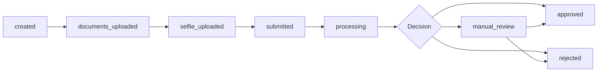

# API Design for eKYC

## Definition

The server-side API that receives verification data, processes it, and returns results. Good API design enables easy integration, handles async processing, and provides clear status management.

---

## Core API Endpoints

| Endpoint | Method | Purpose |
|----------|--------|---------|
| `POST /v1/sessions` | Create | Create verification session with configuration |
| `POST /v1/sessions/{id}/documents` | Upload | Upload document image |
| `POST /v1/sessions/{id}/selfie` | Upload | Upload selfie/liveness capture |
| `POST /v1/sessions/{id}/submit` | Action | Trigger processing |
| `GET /v1/sessions/{id}` | Read | Get current status and results |
| `GET /v1/sessions/{id}/report` | Read | Get detailed verification report |

## Session States



## Webhook Payload

```json
{
  "event": "verification.completed",
  "session_id": "sess_abc123",
  "status": "approved",
  "confidence": 0.95,
  "checks": {
    "document_authenticity": "pass",
    "face_match": "pass",
    "face_liveness": "pass",
    "sanctions_screening": "clear",
    "pep_screening": "clear"
  },
  "extracted_data": {
    "full_name": "JOHN DOE",
    "date_of_birth": "1990-01-15",
    "document_number": "AB1234567",
    "document_type": "passport",
    "nationality": "GBR"
  }
}
```

---

## Key Takeaways

!!! success "Summary"
    - **Session-based** API: create session → upload data → submit → poll/webhook for result
    - **Async processing** is essential — verification takes 2-30 seconds
    - **Webhooks** for real-time notifications; **polling** as fallback
    - **Idempotency** on uploads prevents duplicate processing
    - API versioning (`/v1/`) enables non-breaking evolution

---

## Related Articles

- [SDK Integration Patterns](sdk-integration-patterns.md)
- [Webhook & Callback Architecture](webhook-callback-architecture.md)
