# Decision Engine Architecture

## Definition

The **decision engine** aggregates signals from all verification components — face liveness, face match, document authenticity, screening results — and produces a final decision: auto-approve, manual review, or auto-reject.

---

## Decision Architecture

```mermaid
graph TD
    A[Verification Signals] --> B[Signal Aggregation]

    A --> A1["Face liveness score: 0.95"]
    A --> A2["Face match score: 0.78"]
    A --> A3["Document authenticity: 0.92"]
    A --> A4["Document liveness: 0.88"]
    A --> A5["Sanctions: clear"]
    A --> A6["PEP: not a PEP"]
    A --> A7["Adverse media: none"]

    B --> C[Risk Scoring Model]
    C --> D{Decision Rules}

    D -->|Score > 85 AND no screening hits| E["✅ Auto-Approve<br/>70-85% of cases"]
    D -->|Score 50-85 OR low-confidence signal| F["⚠️ Manual Review<br/>8-15% of cases"]
    D -->|Score < 50 OR screening hit| G["❌ Auto-Reject<br/>3-8% of cases"]
    D -->|Sanctions match| H["🚨 Compliance Escalation<br/><0.1%"]

    style E fill:#2E7D32,color:#fff
    style G fill:#e53935,color:#fff
    style H fill:#6A1B9A,color:#fff
```

## Weighted Risk Score

| Signal | Weight | Score Range |
|--------|--------|-------------|
| Face liveness | 25% | 0-100 |
| Face match | 20% | 0-100 |
| Document authenticity | 15% | 0-100 |
| Document liveness | 10% | 0-100 |
| OCR confidence | 10% | 0-100 |
| Database verification | 10% | 0-100 |
| Screening (sanctions/PEP) | 10% | Binary (pass/fail override) |

## Rules Engine

| Rule Type | Example |
|-----------|---------|
| **Hard rules** | Sanctions hit → always escalate to compliance |
| **Threshold rules** | Face match < 0.50 → auto-reject |
| **Combination rules** | Liveness pass + match fail → manual review |
| **Business rules** | High-value account → always manual review regardless of score |
| **Country rules** | FATF grey list country → require EDD |

---

## Key Takeaways

!!! success "Summary"
    - Decision engine combines **weighted signals** from all verification components
    - **Hard rules** (sanctions) override all scores — compliance is non-negotiable
    - Target: **70-85% auto-approve** rate for efficient operations
    - Rules should be **configurable** per client — different risk appetites
    - Decision audit trail is **legally required** — every decision must be explainable

---

## Related Articles

- [Manual Review Workflow](manual-review-workflow.md)
- [Risk Scoring Engines](../06-fraud-risk/risk-scoring-engines.md)
