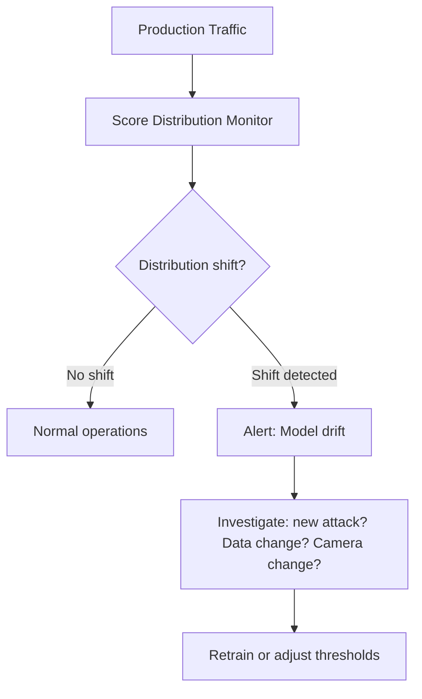

# eKYC Monitoring & Observability

## Definition

Monitoring an eKYC system in production — tracking accuracy, latency, throughput, error rates, and compliance metrics to ensure the system performs reliably at scale.

---

## Key Metrics Dashboard

| Category | Metric | Alert Threshold |
|----------|--------|----------------|
| **Volume** | Verifications per hour/day | ±30% from baseline |
| **Latency** | P50, P95, P99 processing time | P95 > 10s |
| **Accuracy** | STP rate, manual review rate, rejection rate | STP < 70% or reject > 15% |
| **Errors** | API error rate, SDK crash rate | > 1% error rate |
| **Liveness** | Spoof detection rate, false rejection rate | Spoof rate > 5% |
| **Face match** | Average match score, distribution shift | Mean shift > 0.05 |
| **OCR** | Field-level accuracy, confidence scores | Avg confidence < 0.90 |
| **Screening** | Sanctions hit rate, PEP hit rate | Unusual spike |
| **Infra** | GPU utilization, queue depth, memory | GPU > 90%, queue > 1000 |

## Model Drift Detection

---

## Key Takeaways

!!! success "Summary"
    - Monitor **accuracy metrics** (STP rate, rejection rate) as closely as **infrastructure metrics** (latency, uptime)
    - **Score distribution monitoring** detects model drift before it impacts customers
    - **Compliance dashboards** (screening hit rates, manual review SLAs) are required for audit
    - Set alerts on **leading indicators** — catch problems before they cascade

---

## Related Articles

- [Decision Engine Architecture](decision-engine-architecture.md)
- [eKYC Analytics & Reporting](ekyc-analytics-reporting.md)
