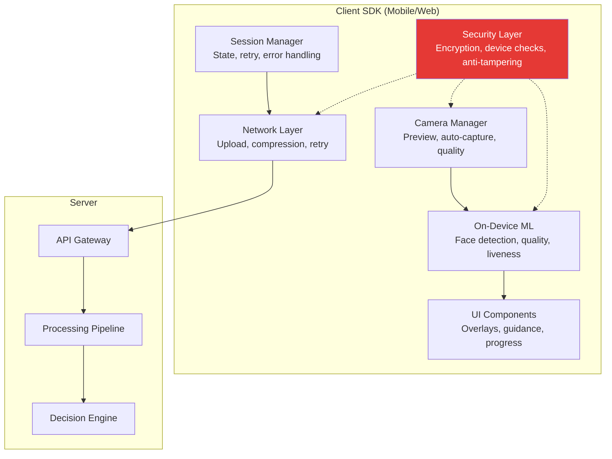

# eKYC SDK Architecture

## Definition

An **eKYC SDK** is a software library integrated into a client's mobile or web application that handles document capture, selfie/liveness capture, on-device processing, and server communication — providing the complete verification experience within the client's app.

---

## SDK Architecture

---

## Key SDK Components

### Camera Manager

| Feature | Purpose |
|---------|---------|
| **Auto-focus** | Ensure sharp document/face capture |
| **Auto-exposure** | Handle varying lighting |
| **Auto-capture** | Trigger capture when quality criteria met |
| **Resolution control** | Capture at optimal resolution (not too high = slow, not too low = poor OCR) |
| **Flash control** | Enable flash for low-light document capture |
| **Orientation lock** | Prevent rotation during capture |

### On-Device ML Models

| Model | Size | Purpose | Latency |
|-------|------|---------|---------|
| **Face detector** (SCRFD-500M) | 2.5MB | Locate face, guide user positioning | 5-15ms |
| **Face quality** | 1-3MB | Check blur, brightness, pose, size | 5-10ms |
| **Quick liveness** | 3-6MB | First-pass liveness check | 10-25ms |
| **Document detector** | 2-5MB | Detect document edges, classify type | 10-20ms |
| **Barcode/QR reader** | 1-2MB | Read encoded data | 5-10ms |

### Security Layer

| Check | What It Prevents |
|-------|-----------------|
| **Root/jailbreak detection** | Compromised devices that can inject camera |
| **Emulator detection** | Running app in Android emulator |
| **Virtual camera detection** | OBS, ManyCam replacing real camera |
| **Debug mode detection** | Debugger attached to inspect/modify app |
| **App integrity** | Code hasn't been modified (tampered APK) |
| **Screen recording detection** | Prevent capture of sensitive data |
| **SSL pinning** | Prevent man-in-the-middle attacks |

---

## Platform Considerations

| Aspect | Android | iOS | Web |
|--------|---------|-----|-----|
| **Camera API** | Camera2 / CameraX | AVFoundation | MediaDevices (WebRTC) |
| **ML runtime** | TFLite, ONNX, NNAPI | CoreML, ONNX | WASM, WebGL |
| **Security** | Play Integrity API | App Attest, DeviceCheck | Limited |
| **SDK size** | 15-40MB | 15-40MB | 5-15MB (WASM) |
| **Minimum OS** | Android 7+ (API 24) | iOS 13+ | Modern browsers |
| **Virtual camera risk** | High (v4l2loopback) | Low (restricted by Apple) | Medium (browser extensions) |

---

## SDK Delivery Models

| Model | How It Works | Pros | Cons |
|-------|-------------|------|------|
| **Native SDK** | Library integrated into app code | Best performance, full camera control | Platform-specific development |
| **WebView SDK** | Web-based SDK in native WebView | Cross-platform, quick updates | Limited camera access, security concerns |
| **React Native / Flutter** | Plugin for cross-platform frameworks | Single codebase | Bridge overhead, camera limitations |
| **API-only** | No SDK — client builds UI, sends images to API | Full UI control | Client responsible for quality, security |

---

## Key Takeaways

!!! success "Summary"
    - SDK architecture combines **camera management, on-device ML, security, and networking**
    - On-device models provide **real-time feedback** — guiding users for best capture quality
    - **Security layer is critical** — root detection, virtual camera detection, app integrity
    - **Native SDK** offers best performance and security; **WebView** offers easiest integration
    - SDK size is typically **15-40MB** including ML models
    - **iOS is more secure** than Android by default (restricted camera access, no virtual cameras)

---

## Related Articles

- **Next**: [SDK Integration Patterns →](sdk-integration-patterns.md)
- [On-Device Biometric Processing](../02-biometrics-face/on-device-biometric-processing.md)
- [Injection Attacks](../02-biometrics-face/injection-attack.md)
