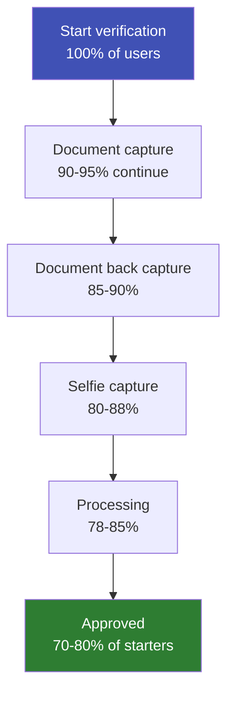

# eKYC UX Best Practices

## Definition

UX in eKYC directly impacts **conversion rates** — the percentage of users who start verification and successfully complete it. Poor UX causes drop-offs; great UX maximizes first-attempt success.

---

## The eKYC UX Funnel

**Each step loses 5-15% of users.** UX optimization at each step compounds.

---

## Best Practices by Step

### Document Capture

| Practice | Impact |
|----------|--------|
| **Auto-capture** (don't make user tap a button) | +10-15% first-attempt success |
| **Real-time quality overlay** (green = good, red = fix) | +8-12% quality improvement |
| **Specific guidance** ("Move closer" not just "Poor quality") | +5-10% success |
| **Edge detection overlay** | Guides document positioning |
| **Torch/flash option** for low light | Prevents dark captures |

### Selfie Capture

| Practice | Impact |
|----------|--------|
| **Face oval guide** | Centers face correctly |
| **"Look at the camera" instruction** | Ensures frontal pose |
| **Passive liveness** (no challenge instructions) | -50% drop-off vs active |
| **Countdown timer** (3, 2, 1) before capture | Prepares user |
| **Immediate retry** with specific error message | "Face too dark — find better lighting" |

### General

| Practice | Impact |
|----------|--------|
| **Progress indicator** (Step 1 of 3) | Reduces anxiety, sets expectations |
| **< 60 second total flow** | Optimal completion rate |
| **Clear error messages** (not "Verification failed") | Reduces support tickets |
| **No required app permissions beyond camera** | Reduces permission anxiety |
| **Works in portrait mode only** | Simpler orientation handling |

---

## Key Takeaways

!!! success "Summary"
    - **Auto-capture + real-time guidance** are the two highest-impact UX features
    - **Passive liveness** dramatically reduces drop-off vs active (blink/turn)
    - Target: **< 60 seconds** end-to-end, **> 80% completion rate**
    - Specific error messages ("Face too dark") outperform generic ones ("Please try again")
    - Every 1% improvement in completion rate = significant business value at scale

---

## Related Articles

- [Conversion Optimization](conversion-optimization.md)
- [Accessibility in eKYC](accessibility-ekyc.md)
- [eKYC SDK Architecture](ekyc-sdk-architecture.md)
