# 🚀 Onboarding Workflow

## Building the Complete eKYC User Journey

This section covers the **end-to-end onboarding experience** — from SDK integration and UX design to decision engines, manual review queues, webhook architecture, and conversion optimization. Where previous sections covered individual AI components, this section covers how they're **assembled into a production system**.

---

## Articles in This Section

### SDK & Integration
| # | Article | What You'll Learn |
|---|---------|-------------------|
| 1 | [eKYC SDK Architecture](ekyc-sdk-architecture.md) | Mobile/web SDK design, camera management, on-device processing |
| 2 | [SDK Integration Patterns](sdk-integration-patterns.md) | Native, WebView, hybrid, API-only — tradeoffs |
| 3 | [API Design for eKYC](api-design-ekyc.md) | REST API design, session management, async processing |

### User Experience
| # | Article | What You'll Learn |
|---|---------|-------------------|
| 4 | [eKYC UX Best Practices](ekyc-ux-best-practices.md) | Camera guidance, error handling, progress indicators |
| 5 | [Conversion Optimization](conversion-optimization.md) | Drop-off analysis, funnel optimization, A/B testing |
| 6 | [Accessibility in eKYC](accessibility-ekyc.md) | Designing for disabilities, elderly, low-literacy users |
| 7 | [Multi-Channel Onboarding](multi-channel-onboarding.md) | Mobile, web, branch, agent-assisted, hybrid flows |

### Decision & Processing
| # | Article | What You'll Learn |
|---|---------|-------------------|
| 8 | [Decision Engine Architecture](decision-engine-architecture.md) | Risk scoring, rules engine, auto-approve/reject/review |
| 9 | [Manual Review Workflow](manual-review-workflow.md) | Review queues, agent tools, SLA management |
| 10 | [Webhook & Callback Architecture](webhook-callback-architecture.md) | Async notifications, retry logic, status updates |

### Operations & Optimization
| # | Article | What You'll Learn |
|---|---------|-------------------|
| 11 | [eKYC Monitoring & Observability](ekyc-monitoring-observability.md) | Metrics, dashboards, alerting, SLA tracking |
| 12 | [A/B Testing for eKYC](ab-testing-ekyc.md) | Testing thresholds, flows, UI variants |
| 13 | [Retry & Fallback Strategies](retry-fallback-strategies.md) | Handling failures gracefully |
| 14 | [Vendor Orchestration](vendor-orchestration.md) | Multi-vendor routing, failover, cost optimization |
| 15 | [eKYC Analytics & Reporting](ekyc-analytics-reporting.md) | Business intelligence, compliance reporting |

---

## The Complete Onboarding Flow

```mermaid
graph TD
    A[User Starts Onboarding] --> B[SDK Initialization<br/>Session created, config loaded]
    B --> C[Document Capture<br/>Auto-capture with quality guidance]
    C --> D[Selfie Capture<br/>Liveness + face capture]
    D --> E[Data Collection<br/>Additional fields if needed]
    E --> F[Submission<br/>All data sent to server]

    F --> G[Server Processing]
    G --> G1[Document processing<br/>OCR + forensics + liveness]
    G --> G2[Face processing<br/>Liveness + matching]
    G --> G3[Screening<br/>Sanctions + PEP + adverse media]
    G --> G4[Database verification<br/>Government API checks]

    G1 & G2 & G3 & G4 --> H[Decision Engine]
    H --> I{Decision}
    I -->|Auto-approve 70-85%| J[✅ Webhook: Approved]
    I -->|Manual review 8-15%| K[Review Queue]
    I -->|Auto-reject 3-8%| L[❌ Webhook: Rejected]

    K --> M[Agent Reviews]
    M --> N[✅ Approved] & O[❌ Rejected]

    J & N --> P[Account Activated]
    L & O --> Q[Rejection + Reason]

    style H fill:#4051B5,color:#fff
    style P fill:#2E7D32,color:#fff
```

