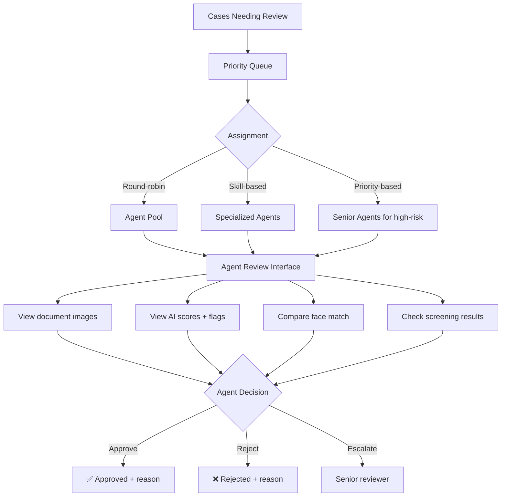

# Manual Review Workflow

## Definition

When the decision engine routes a verification to **manual review**, a human agent examines the case and makes a final approve/reject decision. Efficient manual review is critical for operations at scale.

---

## Review Queue Architecture

## Agent Interface Requirements

| Component | What It Shows |
|-----------|-------------|
| **Document viewer** | Original images with zoom, rotate, enhance |
| **AI overlay** | Highlighted issues — low-confidence OCR fields, forensic flags |
| **Face comparison** | Side-by-side selfie vs document photo with match score |
| **Screening results** | PEP/sanctions hits with source details |
| **Customer data** | Extracted OCR data, editable for corrections |
| **Decision buttons** | Approve / Reject / Escalate with mandatory reason selection |
| **Timer** | SLA countdown for the case |

## SLA Targets

| Priority | Target Resolution | Case Type |
|----------|------------------|-----------|
| **P1 - Critical** | < 5 minutes | Sanctions escalation |
| **P2 - High** | < 30 minutes | Borderline matches, PEP hits |
| **P3 - Normal** | < 4 hours | Standard review cases |
| **P4 - Low** | < 24 hours | Bulk re-review, quality audit |

## Agent Productivity

| Metric | Target |
|--------|--------|
| **Cases per hour** | 10-15 (standard), 5-8 (complex/EDD) |
| **Accuracy** | > 98% agreement with quality audit |
| **SLA compliance** | > 95% within SLA |

---

## Key Takeaways

!!! success "Summary"
    - Manual review handles **8-15%** of verifications — must be efficient and scalable
    - **AI-assisted review** (pre-highlighted issues, scores) dramatically improves agent speed
    - **SLA management** with priority queuing prevents backlogs
    - **Audit trail** for every manual decision is required for compliance
    - At scale (1M+ verifications/month), this means **100K-150K manual reviews** — operational challenge

---

## Related Articles

- [Decision Engine Architecture](decision-engine-architecture.md)
- [eKYC Monitoring & Observability](ekyc-monitoring-observability.md)
