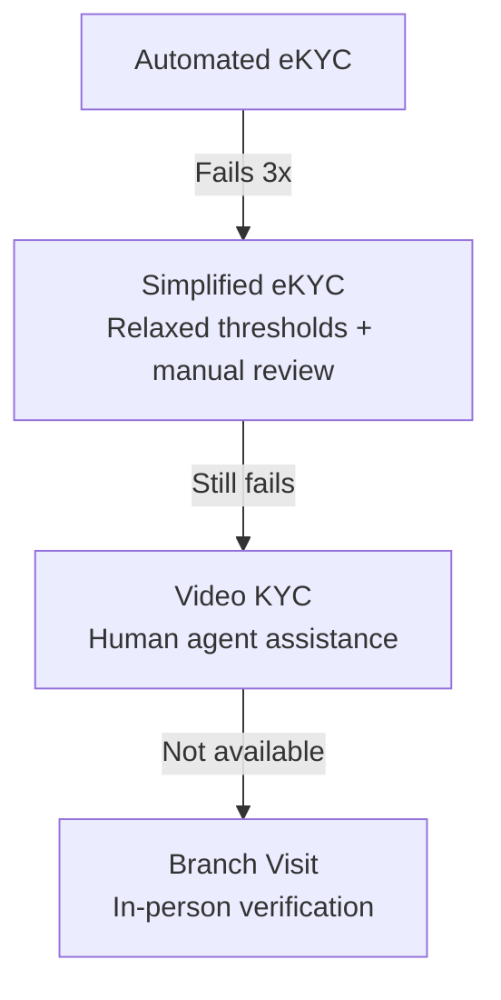

# Retry & Fallback Strategies

## Definition

How to handle failures gracefully in eKYC — from individual step retries to complete fallback paths — minimizing user drop-off while maintaining security.

---

## Retry Strategy per Step

| Step | Max Retries | Guidance on Retry | Fallback |
|------|------------|-------------------|----------|
| **Document capture** | 3 | Specific quality feedback | Manual upload option |
| **Selfie capture** | 3 | Lighting/position guidance | Active liveness as fallback |
| **Face match fail** | 1 retry with re-capture | "Ensure good lighting, remove glasses" | Manual review |
| **Liveness fail** | 2 | "Hold still, ensure good lighting" | V-KYC escalation |
| **OCR low confidence** | 1 re-capture | "Ensure no glare on document" | Manual data entry |
| **Database timeout** | 3 auto-retries | Invisible to user | Queue for async retry |
| **Complete failure** | — | — | V-KYC or branch visit |

## Fallback Chain

---

## Key Takeaways

!!! success "Summary"
    - **Specific guidance on retry** ("Move into better light") dramatically improves retry success
    - **Fallback chain** ensures every user has a path to completion
    - **V-KYC is the universal fallback** when automated eKYC can't resolve
    - Invisible retries (database timeouts) should be handled automatically

---

## Related Articles

- [eKYC UX Best Practices](ekyc-ux-best-practices.md)
- [Video KYC](../01-identity-verification/vkyc-video-kyc.md)
