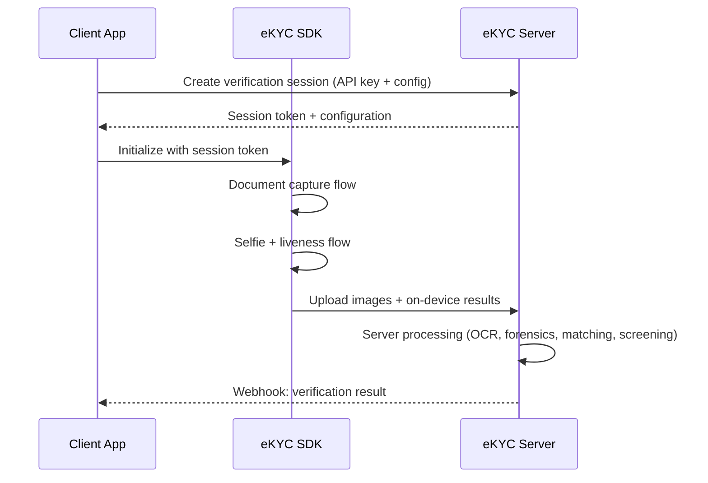

# SDK Integration Patterns

## Definition

How client applications integrate eKYC verification — from native SDK embedding to pure API-based approaches, each with distinct tradeoffs in security, UX, and development effort.

---

## Integration Models

| Pattern | How It Works | Security | UX Quality | Dev Effort |
|---------|-------------|----------|------------|------------|
| **Native SDK** | SDK library linked into native app | ⭐⭐⭐⭐⭐ | ⭐⭐⭐⭐⭐ | ⭐⭐⭐ |
| **WebView** | Web-based SDK loaded in app WebView | ⭐⭐⭐ | ⭐⭐⭐ | ⭐⭐⭐⭐ |
| **URL redirect** | User redirected to provider's hosted page | ⭐⭐⭐⭐ | ⭐⭐ | ⭐⭐⭐⭐⭐ |
| **API-only** | Client builds all UI, sends data to API | ⭐⭐ | Variable | ⭐⭐ |
| **iFrame embed** | Provider's UI embedded in client's web page | ⭐⭐⭐ | ⭐⭐⭐ | ⭐⭐⭐⭐ |

---

## Typical Integration Flow

---

## Key Takeaways

!!! success "Summary"
    - **Native SDK** is recommended for highest security and best UX
    - **URL redirect** is easiest to integrate — no SDK development needed
    - **API-only** gives full control but shifts security responsibility to the client
    - Most enterprise clients use **Native SDK** for mobile apps and **iFrame/redirect** for web

---

## Related Articles

- [eKYC SDK Architecture](ekyc-sdk-architecture.md)
- [API Design for eKYC](api-design-ekyc.md)
