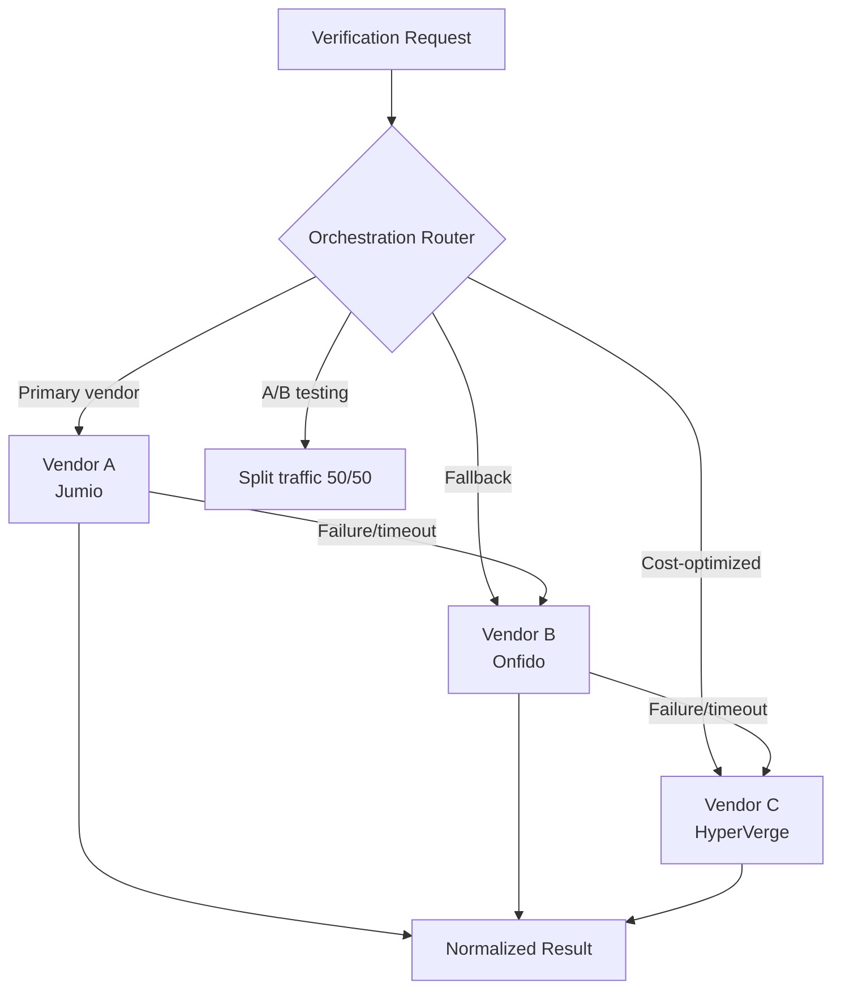

# Vendor Orchestration

## Definition

**Vendor orchestration** routes verification requests across multiple eKYC vendors based on rules — optimizing for cost, accuracy, speed, and reliability through multi-vendor strategies.

---

## Orchestration Patterns

## Routing Strategies

| Strategy | How It Works | Benefit |
|----------|-------------|---------|
| **Primary + fallback** | Route to primary; on failure, try secondary | High availability |
| **Best-of-breed** | Different vendors for different capabilities | Highest accuracy per component |
| **Cost-optimized** | Route to cheapest vendor that meets quality threshold | Lower cost |
| **Geographic** | Route based on document country of origin | Best coverage |
| **A/B testing** | Split traffic to compare vendor performance | Data-driven vendor selection |
| **Waterfall** | Try vendors in sequence until one passes | Maximize approval rate |

---

## Key Takeaways

!!! success "Summary"
    - Orchestration avoids **vendor lock-in** and provides **redundancy**
    - **Best-of-breed** routing (e.g., Vendor A for docs + Vendor B for liveness) maximizes quality
    - **Cost optimization** can reduce per-verification cost by 20-40%
    - Orchestration platforms: **Alloy, Persona, Sardine, Unit21**

---

## Related Articles

- [eKYC Vendor Landscape](../00-foundations/ekyc-vendor-landscape.md)
- [Decision Engine Architecture](decision-engine-architecture.md)
