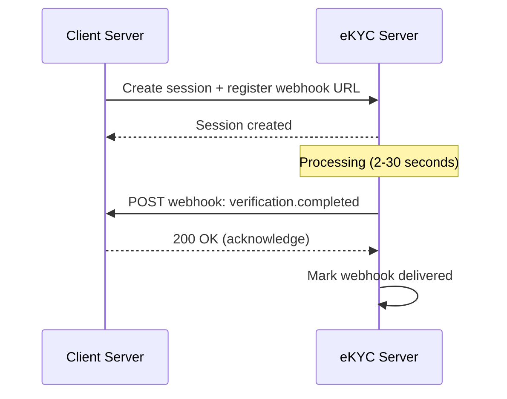

# Webhook & Callback Architecture

## Definition

**Webhooks** notify client systems of verification results asynchronously — eliminating the need for polling and enabling real-time integration with the client's onboarding flow.

---

## Webhook Flow

## Reliability

| Feature | Purpose |
|---------|---------|
| **Retry with exponential backoff** | 1s, 5s, 30s, 5min, 30min — handle temporary failures |
| **Idempotency key** | Prevent duplicate processing if webhook delivered twice |
| **Signature verification** | HMAC-SHA256 signature proves webhook is from eKYC provider |
| **Dead letter queue** | Store failed webhooks for manual retry |
| **Webhook logs** | Full audit trail of all webhook attempts |

---

## Key Takeaways

!!! success "Summary"
    - Webhooks enable **real-time** result notification — essential for seamless onboarding UX
    - **Retry with backoff** + **idempotency** + **signature verification** = reliable, secure delivery
    - Always offer **polling as fallback** — webhooks can fail

---

## Related Articles

- [API Design for eKYC](api-design-ekyc.md)
- [eKYC Monitoring & Observability](ekyc-monitoring-observability.md)
