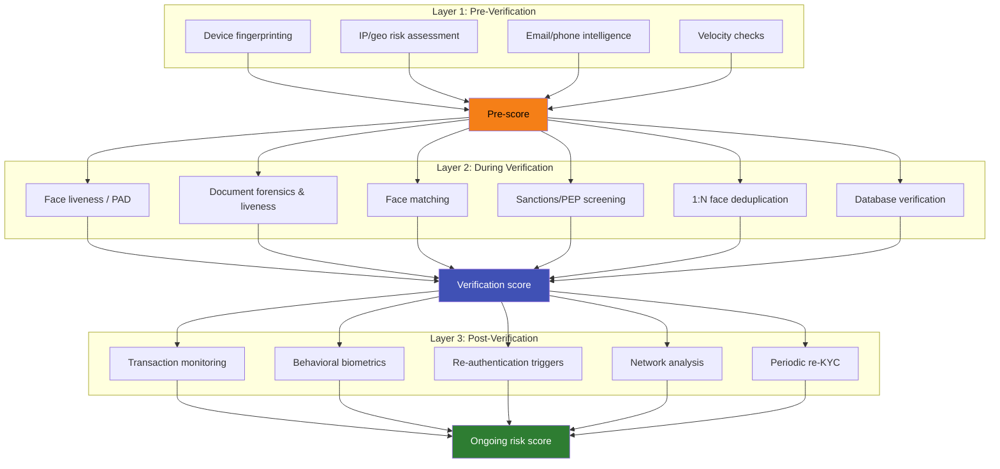

# Fraud Prevention Framework

## Definition

A **layered defense framework** that combines multiple fraud prevention signals at different stages — pre-verification, during verification, and post-verification — for comprehensive protection.

---

## The Three-Layer Defense

## Defense by Attack Type

| Attack | Layer 1 | Layer 2 | Layer 3 |
|--------|---------|---------|---------|
| **Stolen document + photo** | Device risk | Liveness detection | — |
| **Deepfake + injection** | Emulator/root detection | Injection prevention | — |
| **Synthetic identity** | Velocity, device reuse | Database verification, dedup | Network analysis |
| **Fraud ring** | Shared device/IP detection | Document similarity | Cross-institution linking |
| **Money mule** | — | Normal eKYC passes | Transaction monitoring |
| **Account takeover** | — | — | Behavioral change detection |

---

## Key Takeaways

!!! success "Summary"
    - **No single layer catches all fraud** — layered defense is essential
    - **Pre-verification** (device, IP) is the cheapest gate — reject obvious fraud before expensive processing
    - **During verification** (liveness, forensics, screening) is the core eKYC defense
    - **Post-verification** (monitoring, behavioral) catches fraud that passes initial checks
    - Each fraud type requires **different layers** — synthetic identity needs post-verification network analysis

---

## Related Articles

- [Identity Fraud Overview](identity-fraud-overview.md)
- [Risk Scoring Engines](risk-scoring-engines.md)
- [Decision Engine Architecture](../05-onboarding-workflow/decision-engine-architecture.md)
