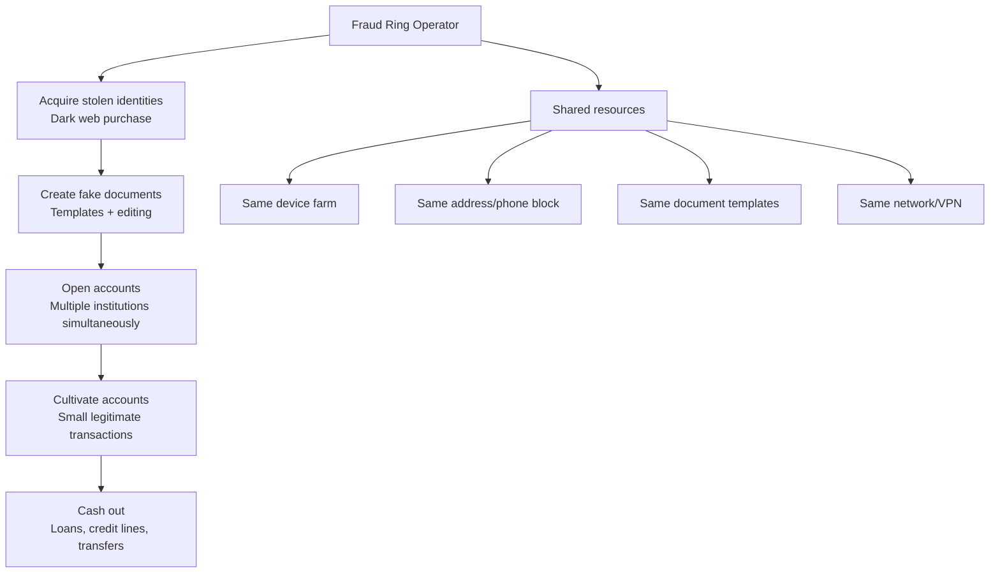

# Fraud Rings & Organized Fraud

## Definition

**Fraud rings** are coordinated groups that create multiple fraudulent accounts in a systematic operation — using shared resources (devices, addresses, documents) to scale identity fraud.

---

## How Fraud Rings Operate

## Detection Signals

| Signal | What It Reveals |
|--------|----------------|
| **Same device** | Multiple accounts from same phone/computer |
| **Same IP/network** | Multiple verifications from same network |
| **Shared address** | Many unrelated people at same address |
| **Shared phone** | Same phone number across accounts |
| **Document similarity** | Same template/style across "different" documents |
| **Face similarity** | Same face or similar faces (1:N dedup) |
| **Temporal clustering** | Many accounts opened in short timeframe |
| **Behavioral similarity** | Same interaction patterns across sessions |

---

## Key Takeaways

!!! success "Summary"
    - Fraud rings are **the most damaging** fraud type — coordinated, high-volume, systematic
    - Detection requires **network/graph analysis** — individual account looks normal, pattern reveals the ring
    - **Device fingerprinting**, **IP analysis**, and **1:N face dedup** are the primary detection signals
    - Cross-institution **consortium data sharing** multiplies detection power

---

## Related Articles

- [Network Analysis for Fraud](network-analysis-fraud.md)
- [Device Intelligence](device-intelligence.md)
- [Consortium Data & Fraud Sharing](consortium-fraud-sharing.md)
