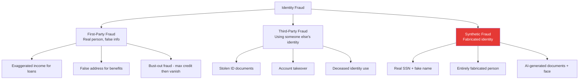

# Identity Fraud Overview

## Definition

**Identity fraud** occurs when someone uses another person's identity information — or a fabricated identity — to gain unauthorized access to financial services, benefits, or other resources. eKYC systems are the primary defense against identity fraud at the point of account opening.

---

## Fraud Types

---

## Scale of Identity Fraud

| Metric | Value | Source |
|--------|-------|-------|
| **Global identity fraud losses** | $50B+ annually | Various industry reports |
| **US identity fraud (2023)** | $23B losses, 15M victims | Javelin Strategy |
| **UK identity fraud** | £1.8B losses | UK Finance |
| **India digital fraud** | ₹10,000+ crore annually | RBI estimates |
| **Fraud attempt rate at onboarding** | 3-8% of all verifications | Industry average |
| **Synthetic identity fraud** | Fastest-growing type, $6B+ US losses | Federal Reserve |

---

## How Fraud Happens at eKYC

| Attack Vector | Method | eKYC Defense |
|--------------|--------|-------------|
| **Stolen document + printed photo** | Present stolen ID + print victim's photo | Face liveness detection |
| **Stolen document + deepfake** | Use stolen ID + real-time face swap | Deepfake detection + injection prevention |
| **Forged document** | Edit document digitally, change photo/name | Document forensics |
| **Synthetic identity** | Create new identity from mix of real/fake data | Database verification, deduplication |
| **Account takeover** | Compromise existing verified account | Re-authentication, behavioral monitoring |
| **Fraud ring** | Multiple fake accounts from same group | Network analysis, device fingerprinting |

---

## Fraud Trends

| Trend | Direction | Impact on eKYC |
|-------|-----------|---------------|
| **AI-generated content** | ↑ Rapidly increasing | Deepfake faces, synthetic documents harder to detect |
| **Fraud-as-a-Service** | ↑ Growing ecosystem | Lowers barrier — non-technical criminals can attack |
| **Synthetic identity** | ↑ Fastest growing | Hardest to detect — no real victim to alert |
| **Cross-border fraud** | ↑ Increasing | Jurisdictional gaps exploited |
| **Real-time fraud** | ↑ Growing | Attacks during live verification sessions |
| **Biometric spoofing sophistication** | ↑ Advancing | Better masks, better deepfakes |

---

## Key Takeaways

!!! success "Summary"
    - Identity fraud costs **$50B+ globally** — eKYC is the primary defense at account opening
    - **3-8% of verification attempts** are fraudulent — every eKYC system faces active attack
    - **Synthetic identity fraud** is the fastest growing and hardest to detect type
    - **AI is accelerating both attack and defense** — deepfakes vs deepfake detection
    - Effective defense requires **layered approach**: liveness + forensics + screening + device intelligence + network analysis

---

## Related Articles

- **Next**: [Synthetic Identity Fraud →](synthetic-identity-fraud.md)
- [Face Liveness Detection Overview](../02-biometrics-face/face-liveness-detection-overview.md)
- [Document Forensics Overview](../03-document-verification/document-forensics-overview.md)
- [Fraud Prevention Framework](fraud-prevention-framework.md)
