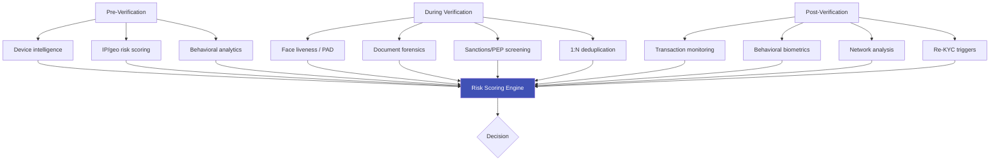

# 🛡️ Fraud & Risk

## Understanding and Defeating Identity Fraud

This section covers the **fraud landscape** that eKYC systems must defend against — from common document fraud and presentation attacks to sophisticated synthetic identities, organized fraud rings, and emerging AI-powered threats. It also covers the risk assessment frameworks and scoring engines that drive decisions.

---

## Articles in This Section

### Fraud Landscape
| # | Article | What You'll Learn |
|---|---------|-------------------|
| 1 | [Identity Fraud Overview](identity-fraud-overview.md) | Types, scale, cost, trends |
| 2 | [Synthetic Identity Fraud](synthetic-identity-fraud.md) | Fabricated identities combining real and fake data |
| 3 | [Account Takeover (ATO)](account-takeover.md) | Hijacking existing accounts post-KYC |
| 4 | [Document Fraud Patterns](document-fraud-patterns.md) | Common document manipulation techniques |
| 5 | [Fraud Rings & Organized Fraud](fraud-rings-organized.md) | Coordinated multi-account fraud operations |

### Risk Assessment
| # | Article | What You'll Learn |
|---|---------|-------------------|
| 6 | [Risk Scoring Engines](risk-scoring-engines.md) | ML-based risk scoring, feature engineering |
| 7 | [Device Intelligence & Fingerprinting](device-intelligence.md) | Device signals for fraud detection |
| 8 | [Behavioral Analytics for Fraud](behavioral-analytics-fraud.md) | Session behavior patterns indicating fraud |
| 9 | [Network Analysis for Fraud](network-analysis-fraud.md) | Graph-based detection of connected fraud |

### Emerging Threats
| # | Article | What You'll Learn |
|---|---------|-------------------|
| 10 | [AI-Powered Fraud](ai-powered-fraud.md) | Deepfakes, AI-generated documents, LLM-assisted fraud |
| 11 | [Fraud-as-a-Service](fraud-as-a-service.md) | Dark web fraud toolkits, commoditized attacks |
| 12 | [Money Mule Detection](money-mule-detection.md) | Detecting accounts used for money laundering |

### Defense Strategies
| # | Article | What You'll Learn |
|---|---------|-------------------|
| 13 | [Fraud Prevention Framework](fraud-prevention-framework.md) | Layered defense, pre/during/post verification |
| 14 | [Consortium Data & Fraud Sharing](consortium-fraud-sharing.md) | Cross-institution fraud intelligence |
| 15 | [Fraud Economics & ROI](fraud-economics-roi.md) | Cost of fraud vs cost of prevention |

---

## The Fraud Defense Stack

