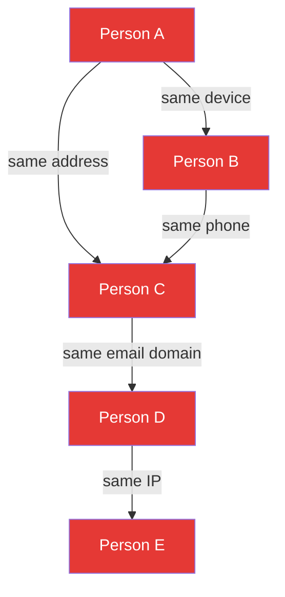

# Network Analysis for Fraud

## Definition

**Network/graph analysis** detects fraud by identifying connections between entities (people, devices, addresses, phone numbers) that reveal organized fraud patterns invisible when examining individual accounts.

---

## Entity Graph

**Individually**: Each person passes eKYC verification.
**As a network**: Five "unrelated" people sharing devices, addresses, and phones = fraud ring.

## Graph Features

| Feature | What It Reveals |
|---------|----------------|
| **Degree centrality** | How many connections an entity has (high = hub) |
| **Community detection** | Clusters of connected entities (fraud rings) |
| **Temporal patterns** | When connections were formed (bulk creation = suspicious) |
| **Cross-institution links** | Same entity across multiple financial institutions |

## Technologies

| Tool | Type | Use |
|------|------|-----|
| **Neo4j** | Graph database | Store and query entity relationships |
| **TigerGraph** | Graph analytics platform | Real-time fraud graph analysis |
| **Amazon Neptune** | Managed graph DB | Cloud-native graph |
| **Graph Neural Networks** | ML on graphs | Learn fraud patterns from graph structure |

---

## Key Takeaways

!!! success "Summary"
    - Network analysis catches fraud that **individual-level analysis misses** — fraud rings, organized crime
    - **Entity resolution** (linking same person across records) is the foundation
    - **Graph databases** (Neo4j, TigerGraph) enable real-time relationship querying
    - **Cross-institution data sharing** dramatically increases graph power

---

## Related Articles

- [Fraud Rings & Organized Fraud](fraud-rings-organized.md)
- [Consortium Data & Fraud Sharing](consortium-fraud-sharing.md)
