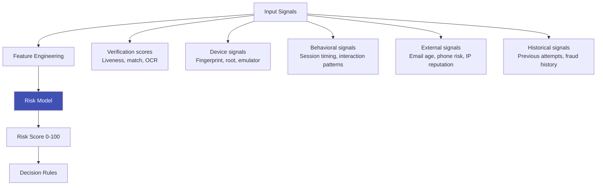

# Risk Scoring Engines

## Definition

A **risk scoring engine** aggregates multiple signals from verification, device, behavioral, and external data sources into a single risk score that drives the approve/review/reject decision.

---

## Scoring Architecture

## Feature Categories

| Category | Example Features |
|----------|-----------------|
| **Verification** | Face match score, liveness score, document forensic score, OCR confidence |
| **Device** | Device age, root status, emulator detection, virtual camera, multiple accounts from device |
| **Behavioral** | Time to complete flow, number of retries, interaction velocity, hesitation patterns |
| **Network** | IP reputation, VPN/proxy detection, geographic consistency, ASN risk |
| **Identity** | Email age, phone carrier risk, SSN/Aadhaar consistency, credit bureau match |
| **Velocity** | Verifications per device/hour, IP address frequency, document reuse |
| **Historical** | Previous failed attempts, fraud flags on linked accounts |

## Model Approaches

| Approach | Pros | Cons |
|----------|------|------|
| **Rules-based** | Interpretable, easy to update, no training data needed | Brittle, misses complex patterns |
| **Logistic regression** | Interpretable, fast, decent performance | Limited to linear relationships |
| **Gradient boosting (XGBoost/LightGBM)** | High accuracy, handles mixed features well | Less interpretable, needs training data |
| **Neural network** | Captures complex patterns | Black box, needs large training data |
| **Ensemble** | Rules + ML model combined | More complex operations |

---

## Key Takeaways

!!! success "Summary"
    - Risk scoring combines **dozens of signals** into a single decision-ready score
    - **Gradient boosting (XGBoost/LightGBM)** is the industry standard for fraud scoring
    - **Feature engineering** (device age, behavioral patterns, velocity) matters more than model choice
    - **Rules + ML hybrid** is the most practical approach — rules for hard constraints, ML for patterns
    - Model must be **explainable** — regulators require justification for rejection decisions

---

## Related Articles

- [Decision Engine Architecture](../05-onboarding-workflow/decision-engine-architecture.md)
- [Device Intelligence](device-intelligence.md)
- [Behavioral Analytics for Fraud](behavioral-analytics-fraud.md)
