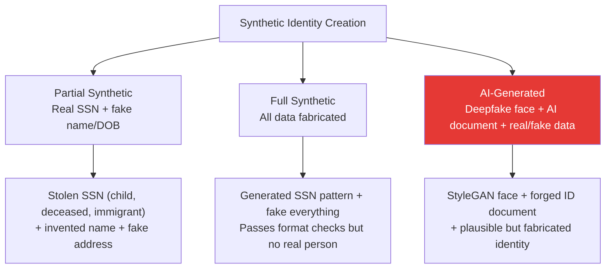

# Synthetic Identity Fraud

## Definition

**Synthetic identity fraud** creates a new, fabricated identity by combining real data (e.g., a stolen SSN/Aadhaar number) with fake data (fabricated name, address, DOB) — or generating an entirely fictitious person. It is the **fastest-growing** and **hardest-to-detect** fraud type because there is no real victim to report the fraud.

---

## How Synthetic Identities Are Created

## Lifecycle of Synthetic Identity Fraud

| Phase | What Happens | Duration |
|-------|-------------|----------|
| **1. Creation** | Build synthetic identity from combined real/fake data | Days |
| **2. Cultivation** | Open accounts, build credit history, make small legitimate transactions | 6-24 months |
| **3. Bust-out** | Max out all credit lines, take loans, cash out | Days-weeks |
| **4. Disappearance** | Abandon identity — no real person to collect from | Permanent loss |

---

## Why It's Hard to Detect

| Reason | Details |
|--------|---------|
| **No victim complaint** | Real identity theft triggers fraud alerts — synthetic doesn't |
| **Passes format checks** | SSN/Aadhaar format is valid even if mismatched |
| **Builds real history** | After cultivation phase, has legitimate-looking credit history |
| **Face doesn't exist** | AI-generated face passes liveness but has no database match |
| **Document may be real** | Real SSN on a forged document with fabricated name |

## Detection Methods

| Method | How It Helps |
|--------|-------------|
| **1:N face deduplication** | Same face across multiple identities |
| **SSN/Aadhaar cross-reference** | Name-SSN mismatch (SSN belongs to different person) |
| **Address analysis** | Multiple unrelated identities at same address |
| **Credit history analysis** | Thin file, no history before a certain date |
| **Device fingerprinting** | Same device used for multiple identities |
| **Network analysis** | Connections between synthetic identities (shared addresses, phones, devices) |
| **AI face detection** | Detect GAN-generated face artifacts |

---

## Key Takeaways

!!! success "Summary"
    - Synthetic identity fraud is the **#1 emerging threat** — $6B+ losses in US alone
    - **No victim reports it** — unlike stolen identity fraud, there's no alert
    - Cultivation phase (6-24 months) means losses are **delayed and massive**
    - Detection requires **cross-referencing multiple signals**: face dedup, database verification, device analysis, network analysis
    - **AI-generated faces** add a new dimension — synthetic people that have never existed

---

## Related Articles

- [Identity Fraud Overview](identity-fraud-overview.md)
- [Face De-Duplication (1:N)](../02-biometrics-face/face-deduplication.md)
- [AI-Powered Fraud](ai-powered-fraud.md)
