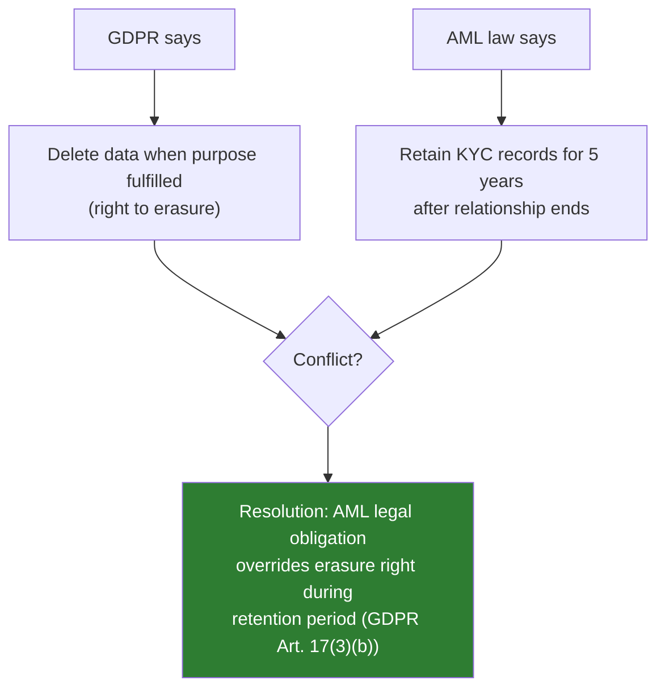

# GDPR & eKYC

## Definition

The **General Data Protection Regulation (GDPR)** is the EU's comprehensive data protection law that significantly impacts eKYC operations — particularly the processing of **biometric data**, which GDPR classifies as a special category requiring enhanced protections.

---

## Key GDPR Provisions for eKYC

| Provision | Impact on eKYC |
|-----------|---------------|
| **Article 6** — Lawful basis | eKYC processing typically relies on legal obligation (AML compliance) or legitimate interest |
| **Article 9** — Special categories | Biometric data (face photos, embeddings) requires explicit consent OR legal obligation exemption |
| **Article 13/14** — Transparency | Must inform users what data is collected, why, how long it's kept, who processes it |
| **Article 15** — Right of access | Users can request copies of their eKYC data |
| **Article 17** — Right to erasure | Users can request deletion (limited by AML record-keeping requirements) |
| **Article 22** — Automated decisions | Individuals have right not to be subject to solely automated decisions with legal effects |
| **Article 25** — Privacy by design | eKYC systems must implement data minimization and protection by design |
| **Article 35** — DPIA | Data Protection Impact Assessment required for biometric processing |

---

## Biometric Data Under GDPR

| Aspect | GDPR Requirement |
|--------|-----------------|
| **Classification** | Article 9: "special category" — highest protection level |
| **Lawful basis** | Explicit consent OR necessary for legal obligation (AML/KYC) |
| **DPIA required** | Yes — mandatory for systematic biometric processing |
| **Data minimization** | Only collect biometric data necessary for verification purpose |
| **Storage limitation** | Delete biometric data when no longer needed (but AML: retain 5 years) |
| **Security** | Encryption at rest and in transit, access controls, pseudonymization |

---

## GDPR vs AML Record-Keeping Tension

---

## Practical Compliance Steps

| Step | Implementation |
|------|---------------|
| **1. Lawful basis** | Document reliance on legal obligation (AML) for identity verification |
| **2. Consent for biometrics** | Obtain explicit, specific, informed consent for biometric processing (or rely on AML legal obligation exemption per member state) |
| **3. Privacy notice** | Clear information about eKYC data processing, purposes, retention, rights |
| **4. DPIA** | Conduct Data Protection Impact Assessment before deploying biometric eKYC |
| **5. Data minimization** | Only capture what's needed — don't store raw images if embeddings suffice |
| **6. Retention policy** | 5-year retention (AML), then automatic deletion |
| **7. Sub-processor agreements** | DPA with eKYC vendor (processor) covering Article 28 requirements |
| **8. Cross-border transfers** | SCCs or adequacy decision for data transfers outside EU |

---

## Penalties

| Violation Level | Maximum Fine | Example Violation |
|----------------|-------------|-------------------|
| **Article 83(4)** | €10M or 2% global turnover | Inadequate security, no DPIA |
| **Article 83(5)** | €20M or 4% global turnover | Unlawful processing of biometric data, no consent |

**Notable case**: Meta — €1.2B fine (2023) for inadequate data transfer safeguards.

---

## Key Takeaways

!!! success "Summary"
    - GDPR classifies biometrics as **special category data** — highest protection level
    - eKYC typically relies on **AML legal obligation** as lawful basis, but some member states require explicit consent for biometrics
    - **DPIA is mandatory** before deploying biometric eKYC in the EU
    - AML 5-year retention **overrides** right to erasure during the retention period
    - **Data minimization** is key — don't store more than needed (prefer embeddings over raw images)
    - Fines up to **€20M or 4% global turnover** for non-compliance

---

## Related Articles

- [India DPDP Act](india-dpdp-act.md)
- [Biometric Data Protection](biometric-data-protection.md)
- [Global Privacy Laws for eKYC](global-privacy-laws-ekyc.md)
