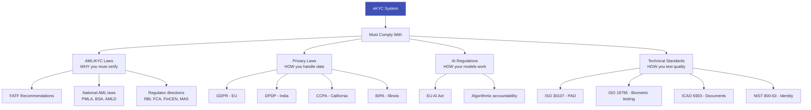

# ⚖️ Regulations & Standards

## The Legal Framework Governing eKYC

Every eKYC system operates within a web of regulations — AML laws that mandate identity verification, data protection laws that restrict how biometric data is handled, and technical standards that define interoperability. This section maps the complete regulatory landscape.

---

## Articles in This Section

### Data Protection & Privacy
| # | Article | What You'll Learn |
|---|---------|-------------------|
| 1 | [GDPR & eKYC](gdpr-ekyc.md) | EU data protection — biometrics as special category, consent, DPIA |
| 2 | [India DPDP Act](india-dpdp-act.md) | Digital Personal Data Protection Act 2023 — impact on eKYC |
| 3 | [Global Privacy Laws for eKYC](global-privacy-laws-ekyc.md) | CCPA, LGPD, PDPA, BIPA — worldwide privacy landscape |
| 4 | [Biometric Data Protection](biometric-data-protection.md) | BIPA, GDPR Article 9, consent requirements, template security |

### AML/KYC Regulations
| # | Article | What You'll Learn |
|---|---------|-------------------|
| 5 | [RBI KYC Master Direction](rbi-kyc-master-direction.md) | India's definitive eKYC regulation — all methods, requirements |
| 6 | [EU AML Regulations (AMLD/AMLR)](eu-aml-regulations.md) | 4AMLD → 6AMLD → AMLR 2024 — EU's evolving AML framework |
| 7 | [USA BSA/CIP/CDD Rule](usa-bsa-cip-cdd.md) | Bank Secrecy Act, Customer Identification Program |
| 8 | [FATF Mutual Evaluations](fatf-mutual-evaluations.md) | How countries are assessed, grey/black list impact |
| 9 | [Regional KYC Regulations](regional-kyc-regulations.md) | Singapore MAS, UAE CBUAE, UK FCA, Hong Kong HKMA |

### AI & Technology Regulations
| # | Article | What You'll Learn |
|---|---------|-------------------|
| 10 | [EU AI Act & Biometrics](eu-ai-act-biometrics.md) | High-risk classification, conformity assessment, fairness |
| 11 | [Algorithmic Accountability](algorithmic-accountability.md) | Explainability, bias testing, audit requirements |

### Technical Standards
| # | Article | What You'll Learn |
|---|---------|-------------------|
| 12 | [ISO 30107 (PAD Testing)](iso-30107-overview.md) | Presentation attack detection testing standard |
| 13 | [ISO 19795 (Biometric Performance)](iso-19795-biometric-performance.md) | Biometric testing methodology standard |
| 14 | [ICAO 9303 (Travel Documents)](icao-9303-travel-documents.md) | MRZ, ePassport chip, biometric specifications |
| 15 | [NIST SP 800-63 (Digital Identity)](nist-sp-800-63.md) | Identity assurance levels, authentication guidelines |
| 16 | [eIDAS Technical Standards](eidas-technical-standards.md) | Trust services, qualified signatures, LoA framework |

### Compliance Operations
| # | Article | What You'll Learn |
|---|---------|-------------------|
| 17 | [Building a Compliance Program](building-compliance-program.md) | MLRO role, policies, training, audit |
| 18 | [Regulatory Sandboxes for eKYC](regulatory-sandboxes.md) | Innovation frameworks, testing new eKYC approaches |

---

## Regulatory Map

