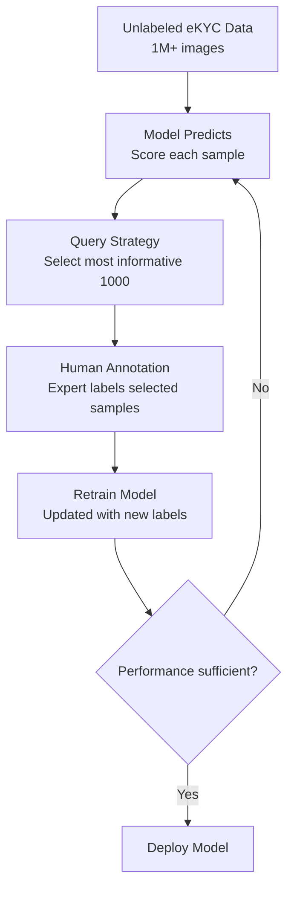

# Active Learning

## Definition

**Active learning** selects the most informative unlabeled examples for human annotation — maximizing model improvement per labeled sample. Critical for eKYC where labeling is expensive (especially liveness and forensics).

---

## Query Strategies

| Strategy | How It Works | Best For |
|----------|-------------|----------|
| **Uncertainty sampling** | Select samples where model is least confident | General — simplest approach |
| **Query-by-committee** | Multiple models disagree on prediction | Ensemble models |
| **Expected model change** | Select samples that would most change model weights | Maximum learning per sample |
| **Diversity sampling** | Select diverse samples covering feature space | Avoiding redundant labels |
| **Core-set** | Select samples that best represent unlabeled data distribution | Large unlabeled pools |

## Active Learning Loop for eKYC

---

## Key Takeaways

!!! success "Summary"
    - Active learning reduces labeling cost by **3-10x** — label only what matters most
    - **Uncertainty sampling** is the simplest and often most effective strategy
    - Especially valuable for **liveness** (expert annotation needed) and **forensics** (subtle ground truth)
    - Combine with **self-supervised pre-training** for maximum data efficiency

---

## Related Articles

- [Self-Supervised Learning](self-supervised-learning.md)
- [Liveness Datasets](../02-biometrics-face/liveness-datasets.md)
