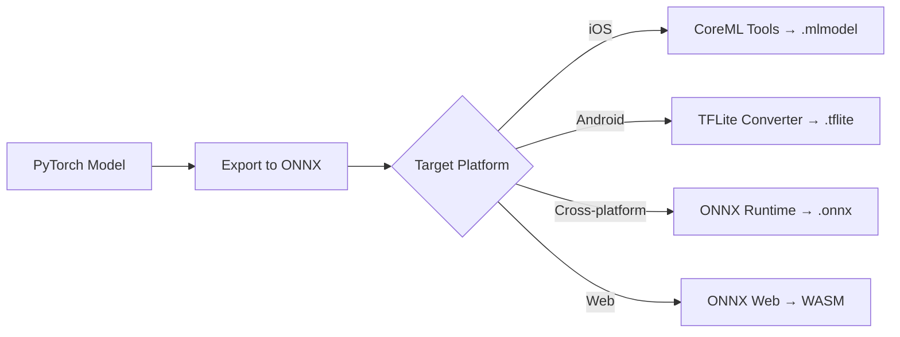

# Edge AI Deployment

## Definition

Deploying ML models on user devices (phones, tablets, IoT) for real-time, privacy-preserving, offline-capable eKYC processing.

---

## Deployment Targets

| Platform | Runtime | Model Format | GPU Access |
|----------|---------|-------------|-----------|
| **iOS** | CoreML | .mlmodel | Neural Engine, GPU |
| **Android** | TFLite / ONNX | .tflite / .onnx | NNAPI, GPU Delegate |
| **Android** | NCNN | .param + .bin | Vulkan GPU |
| **Cross-platform** | ONNX Runtime Mobile | .onnx | Platform-specific |
| **Web** | ONNX Runtime Web | .onnx | WebGL, WASM |

## Conversion Pipeline

---

## Key Takeaways

!!! success "Summary"
    - **ONNX** is the most portable format — convert once, deploy everywhere
    - **CoreML** provides best iOS performance via Neural Engine
    - **Quantize to INT8** before mobile deployment — 2-4x faster, 4x smaller
    - Always benchmark on **actual target devices** — simulator performance differs from real hardware

---

## Related Articles

- [On-Device Biometric Processing](../02-biometrics-face/on-device-biometric-processing.md)
- [Model Optimization & Quantization](model-optimization-quantization.md)
- [Knowledge Distillation](knowledge-distillation.md)
