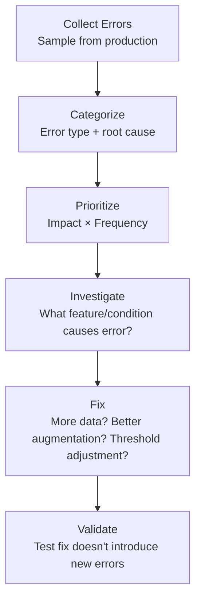

# Error Analysis for eKYC

## Definition

Systematic analysis of where and why eKYC models fail — categorizing errors, identifying patterns, and prioritizing improvements.

---

## Error Categories

| Category | Example | Investigation |
|----------|---------|--------------|
| **False rejection (FR)** | Real user rejected | Why? Low quality? Cross-age? Demographic bias? |
| **False acceptance (FA)** | Spoof/impostor accepted | Why? New attack type? Quality issue? |
| **OCR error** | Wrong field extracted | Why? Damaged text? Wrong template? |
| **Classification error** | Wrong document type | Why? Similar-looking documents? |
| **Liveness false positive** | Real user flagged as spoof | Why? Unusual lighting? Glasses? |

## Error Analysis Process

---

## Key Takeaways

!!! success "Summary"
    - **Systematic error analysis** drives targeted model improvement — more effective than blind retraining
    - Categorize errors by **type and root cause** — not all false rejections have the same fix
    - **Prioritize by impact × frequency** — fix the errors that affect the most users
    - **Per-demographic error analysis** reveals bias that aggregate metrics hide

---

## Related Articles

- [Evaluation Methodology](evaluation-methodology.md)
- [Model Drift & Retraining](model-drift-retraining.md)
