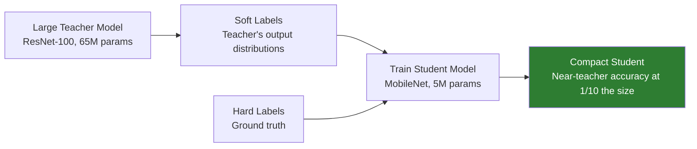

# Knowledge Distillation

## Definition

**Knowledge distillation** trains a small (student) model to mimic a large (teacher) model — compressing eKYC models for mobile/edge deployment while retaining most of the teacher's accuracy.

---

## Distillation Pipeline

## Distillation for eKYC

| Teacher | Student | Task | Accuracy Retention |
|---------|---------|------|-------------------|
| **IResNet-100 (65M)** | MobileFaceNet (1M) | Face recognition | 97-99% of teacher |
| **ResNet-50 (25M)** | CDCN-Lite (1M) | Face liveness | 95-98% of teacher |
| **EfficientNet-B4 (20M)** | MobileNetV3 (5M) | Document classification | 97-99% of teacher |

---

## Key Takeaways

!!! success "Summary"
    - Distillation enables **mobile-deployable models** with near-server-class accuracy
    - Typical compression: **10-60x** fewer parameters with **95-99%** accuracy retention
    - **Soft label** learning (teacher's probability distribution) provides richer training signal than hard labels alone
    - Essential for on-device eKYC SDK models

---

## Related Articles

- [On-Device Biometric Processing](../02-biometrics-face/on-device-biometric-processing.md)
- [Model Optimization & Quantization](model-optimization-quantization.md)
- [Edge AI Deployment](edge-ai-deployment.md)
