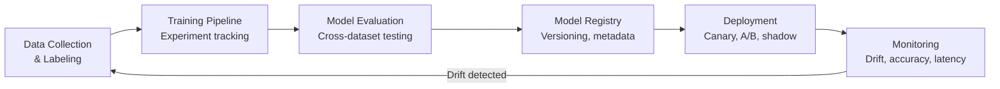

# MLOps for eKYC

## Definition

**MLOps** applies DevOps practices to machine learning — covering training pipelines, model versioning, experiment tracking, CI/CD for models, and production monitoring specific to eKYC.

---

## MLOps Pipeline

## Key Tools

| Category | Tools |
|----------|-------|
| **Experiment tracking** | MLflow, Weights & Biases, Neptune |
| **Data versioning** | DVC, LakeFS |
| **Model registry** | MLflow, AWS SageMaker, Vertex AI |
| **Training orchestration** | Kubeflow, Airflow, Metaflow |
| **Feature store** | Feast, Tecton |
| **Monitoring** | Evidently AI, WhyLabs, Arize |
| **Deployment** | Triton, SageMaker Endpoints, Vertex AI |

---

## Key Takeaways

!!! success "Summary"
    - MLOps is essential for eKYC — models must be **continuously updated** as attacks evolve
    - **Experiment tracking** (W&B, MLflow) prevents losing track of model versions and results
    - **Shadow deployment** (run new model alongside production without serving) validates before switching
    - **Drift monitoring** triggers retraining before accuracy degrades in production

---

## Related Articles

- [Model Drift & Retraining](model-drift-retraining.md)
- [eKYC Monitoring & Observability](../05-onboarding-workflow/ekyc-monitoring-observability.md)
