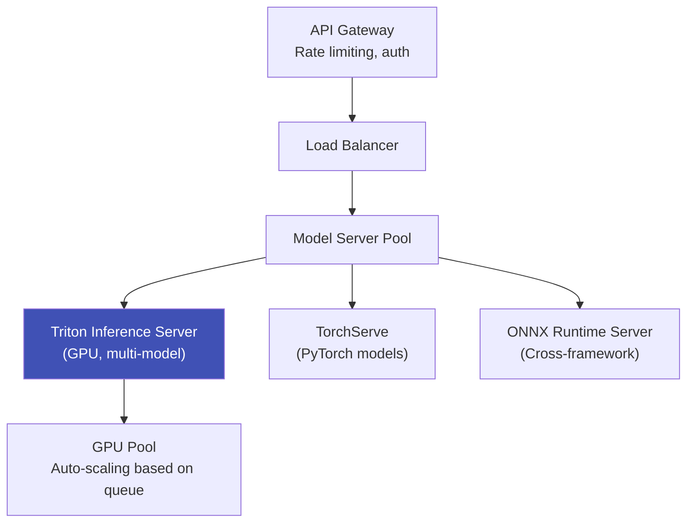

# Model Serving Architecture

## Definition

Infrastructure for serving ML models in production at scale — handling concurrent requests, GPU management, batching, and auto-scaling.

---

## Serving Stack

## Serving Frameworks

| Framework | Key Feature | Best For |
|-----------|-------------|----------|
| **Triton** (NVIDIA) | Multi-model, multi-framework, dynamic batching | Production GPU serving |
| **TorchServe** | PyTorch-native, easy deployment | PyTorch models |
| **TF Serving** | TensorFlow-native, high performance | TensorFlow models |
| **Ray Serve** | Python-native, easy scaling | Complex pipelines |
| **BentoML** | Model packaging + serving | Rapid deployment |

## Key Optimizations

| Optimization | Impact |
|-------------|--------|
| **Dynamic batching** | Batch multiple requests → 2-8x throughput |
| **Model concurrency** | Run multiple models on same GPU | 
| **Model caching** | Keep hot models in GPU memory |
| **Auto-scaling** | Scale GPU instances based on request queue depth |
| **A/B model routing** | Route traffic between model versions |

---

## Key Takeaways

!!! success "Summary"
    - **Triton Inference Server** is the industry standard for GPU model serving
    - **Dynamic batching** is the biggest throughput optimization — batches individual requests automatically
    - **Auto-scaling** based on queue depth handles traffic spikes
    - Multiple eKYC models (liveness, recognition, OCR) can share GPU resources via Triton

---

## Related Articles

- [Model Optimization & Quantization](model-optimization-quantization.md)
- [Document Processing at Scale](../03-document-verification/document-processing-at-scale.md)
