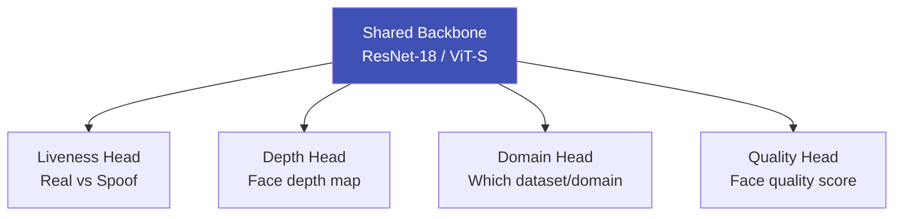

# Multi-Task Learning

## Definition

**Multi-task learning (MTL)** trains a single model on multiple related tasks simultaneously — sharing representations across tasks for better generalization and efficiency.

---

## MTL in eKYC

| Task Combination | Benefit |
|-----------------|---------|
| **Liveness + depth estimation** | Depth provides geometric reasoning about 3D vs 2D |
| **Liveness + domain classification** | Adversarial domain head forces domain-invariant features |
| **Recognition + quality estimation** | Quality awareness improves matching on low-quality inputs |
| **OCR detection + recognition** | Shared features improve both stages |
| **Document classification + field extraction** | Document type informs field locations |

---

## Key Takeaways

!!! success "Summary"
    - MTL improves liveness accuracy by **2-5%** over single-task (binary) training
    - **Liveness + depth + domain** is the standard multi-task combination for face anti-spoofing
    - **Shared backbone** reduces total compute — one model serves multiple purposes
    - Task weighting (relative loss importance) requires careful tuning

---

## Related Articles

- [Liveness Model Architectures](../02-biometrics-face/liveness-model-architectures.md)
- [Knowledge Distillation](knowledge-distillation.md)
