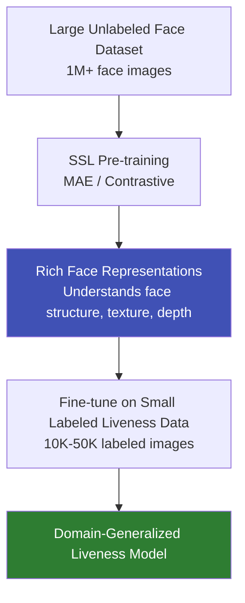

# Self-Supervised Learning

## Definition

**Self-supervised learning (SSL)** trains models on unlabeled data by creating pretext tasks — the model learns rich representations without human annotation, then transfers those representations to downstream eKYC tasks.

---

## SSL Methods Relevant to eKYC

| Method | Pretext Task | eKYC Application |
|--------|-------------|-----------------|
| **MAE (Masked Autoencoder)** | Reconstruct masked image patches | Pre-train face/document understanding |
| **SimCLR / MoCo** | Contrastive: similar images close, different images far | Learn face/document features without labels |
| **DINO / DINOv2** | Self-distillation with no labels | General visual features for any eKYC task |
| **BYOL** | Predict one augmentation from another | Robust feature learning |
| **BEiT** | Masked visual token prediction | Document understanding pre-training |

## SSL for Face Liveness

**Why this works for liveness:**
- Unlabeled face data is abundant (millions available)
- Labeled liveness data is scarce and expensive
- SSL learns **general face features** (texture, structure) that transfer to liveness detection

---

## Key Takeaways

!!! success "Summary"
    - SSL enables learning from **millions of unlabeled images** — critical when labeled data is scarce
    - **MAE** and **contrastive learning** are the most relevant SSL methods for eKYC
    - SSL pre-training + liveness fine-tuning is the **state-of-the-art** approach for domain-generalized liveness
    - **DINOv2** provides strong general visual features applicable across all eKYC vision tasks
    - SSL is especially valuable for liveness because labeled attack data is hard to collect

---

## Related Articles

- [Transfer Learning](transfer-learning-ekyc.md)
- [Domain Generalization for Liveness](../02-biometrics-face/domain-generalization-liveness.md)
- [Foundation Models](foundation-models-ekyc.md)
