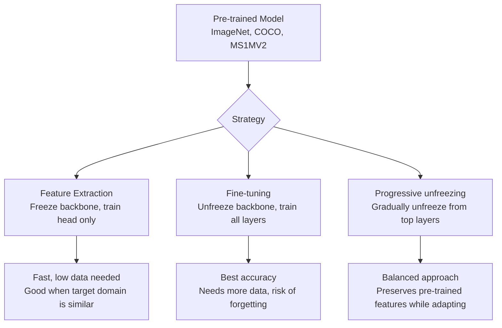

# Transfer Learning for eKYC

## Definition

**Transfer learning** uses models pre-trained on large datasets as starting points for eKYC-specific tasks — dramatically reducing the data and compute needed to achieve high accuracy.

---

## Transfer Learning Strategies

## Common Pre-Training Sources for eKYC

| Task | Pre-trained On | Transfer To |
|------|---------------|-------------|
| **Face liveness** | ImageNet → face datasets | Liveness-specific fine-tuning |
| **Face recognition** | MS1MV2 / Glint360K | Domain-specific face matching |
| **Document OCR** | Synthetic text → real documents | ID-specific text recognition |
| **Document forensics** | ImageNet → manipulation detection | Document-specific tampering |
| **Document classification** | ImageNet → document datasets | ID document classification |

## Fine-Tuning Best Practices

| Practice | Details |
|----------|---------|
| **Lower learning rate** | 10-100x lower than training from scratch |
| **Freeze early layers** | Low-level features (edges, textures) transfer well |
| **Larger learning rate for head** | New classification head needs higher LR |
| **Data augmentation** | Critical when target dataset is small |
| **Early stopping** | Monitor validation loss to prevent overfitting |

---

## Key Takeaways

!!! success "Summary"
    - Transfer learning is **essential** for eKYC — reduces data requirements 10-100x
    - **ImageNet pre-training** is the starting point for most vision tasks
    - **Face-specific pre-training** (MS1MV2) is critical for recognition and liveness
    - **Progressive unfreezing** balances accuracy with preventing catastrophic forgetting
    - Without transfer learning, most eKYC tasks would need prohibitively large labeled datasets

---

## Related Articles

- [Self-Supervised Learning](self-supervised-learning.md)
- [Foundation Models for eKYC](foundation-models-ekyc.md)
- [Domain Generalization](domain-generalization.md)
