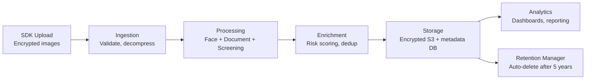

# Data Pipeline Architecture

## Definition

How eKYC data flows from capture to storage to analysis — ingestion, processing, enrichment, storage, and eventual deletion per retention policies.

---

## Pipeline Flow

## Storage Tiers

| Tier | Data | Storage | Retention |
|------|------|---------|-----------|
| **Hot** | Active sessions, recent results | SSD, in-memory cache | Days-weeks |
| **Warm** | Completed verifications | Standard S3, PostgreSQL | 1-5 years |
| **Cold** | Archived compliance records | Glacier/Archive | 5+ years |

---

## Key Takeaways

!!! success "Summary"
    - Data pipeline must handle **encryption end-to-end** — images are biometric PII
    - **Tiered storage** optimizes cost — hot (active) → warm (compliance) → cold (archive)
    - **Retention automation** is required — GDPR/DPDP mandate deletion when purpose fulfilled

---

## Related Articles

- [Image & Video Storage](image-video-storage.md)
- [Data Encryption Strategy](data-encryption-strategy.md)
