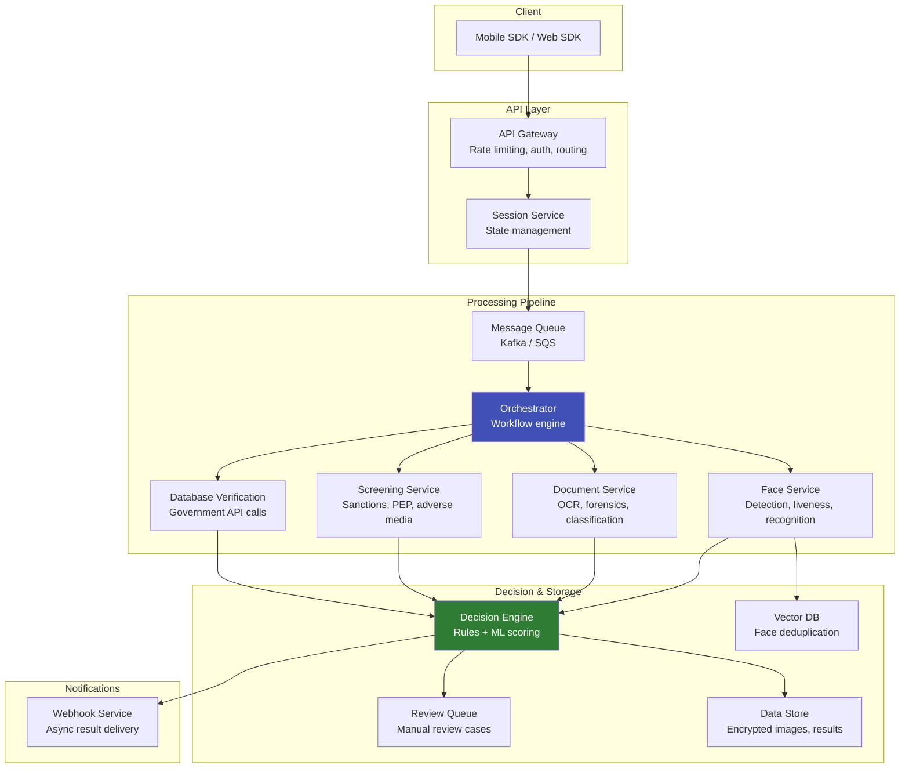

# eKYC System Architecture

## Definition

The end-to-end system architecture for a production eKYC platform — from client SDK through API gateway, processing pipeline, decision engine, and storage.

---

## Reference Architecture

## Service Responsibilities

| Service | Technology | Scaling |
|---------|-----------|---------|
| **API Gateway** | Kong, AWS API Gateway, Nginx | Horizontal (stateless) |
| **Session Service** | Redis + PostgreSQL | Horizontal + replicated cache |
| **Message Queue** | Kafka (high-volume), SQS (simpler) | Partitioned |
| **Face Service** | Python + Triton on GPU | GPU auto-scaling |
| **Document Service** | Python + Triton on GPU | GPU auto-scaling |
| **Screening Service** | REST client to external APIs | Horizontal |
| **Decision Engine** | Rules engine + ML model | Horizontal (CPU) |
| **Vector DB** | Milvus / FAISS | Sharded by volume |
| **Data Store** | S3 (images) + PostgreSQL (metadata) | Standard cloud scaling |

---

## Key Takeaways

!!! success "Summary"
    - **Microservices architecture** with message queue enables independent scaling of GPU-heavy services
    - **Orchestrator** manages the verification workflow — parallel execution of face + document + screening
    - **Face and Document services** are GPU-bound — scale independently based on queue depth
    - **Decision Engine** aggregates all signals — configurable rules per client
    - All data **encrypted at rest and in transit** — compliance requirement

---

## Related Articles

- [Cloud Architecture for eKYC](cloud-architecture-ekyc.md)
- [GPU Infrastructure](gpu-infrastructure.md)
- [Microservices vs Monolith](microservices-vs-monolith.md)
