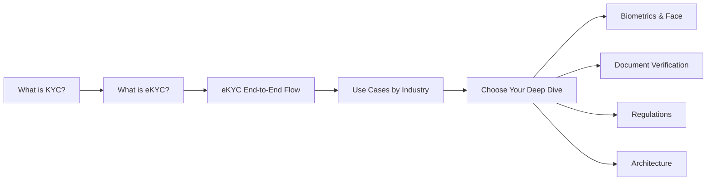

# 🏦 eKYC Knowledge Base

## The Complete Encyclopedia of Electronic Know Your Customer

Welcome to the most comprehensive guide to **eKYC (Electronic Know Your Customer)** — covering everything from foundational concepts to cutting-edge AI/ML techniques, regulations, system architecture, and real-world case studies.

---

## 📖 What's Inside

This knowledge base contains **210+ in-depth articles** organized into 12 categories:

| # | Category | Articles | Description |
|---|----------|----------|-------------|
| 00 | **[Foundations](00-foundations/index.md)** | 12 | KYC basics, eKYC evolution, market landscape, use cases |
| 01 | **[Identity Verification & Compliance](01-identity-verification/index.md)** | 18 | KYC/AML/CDD/EDD, FATF, sanctions screening |
| 02 | **[Biometrics & Face](02-biometrics-face/index.md)** | 32 | Face detection, recognition, liveness, PAD, metrics |
| 03 | **[Document Verification](03-document-verification/index.md)** | 20 | OCR, forensics, document liveness, NFC, MRZ |
| 04 | **[Digital Identity](04-digital-identity/index.md)** | 16 | DID, SSI, wallets, OAuth, FIDO2, Aadhaar |
| 05 | **[Onboarding & Workflow](05-onboarding-workflow/index.md)** | 12 | UX flows, STP, case management, SDKs |
| 06 | **[Fraud & Risk](06-fraud-risk/index.md)** | 16 | Identity fraud, deepfakes, risk scoring, behavioral biometrics |
| 07 | **[Regulations & Standards](07-regulations-standards/index.md)** | 18 | GDPR, DPDP, ISO 30107, NIST FRVT, iBeta |
| 08 | **[AI/ML Techniques](08-ai-ml-techniques/transfer-learning-ekyc.md)** | 20 | Domain generalization, ViT, SSL, quantization, fairness |
| 09 | **[Architecture & Integration](09-infrastructure/index.md)** | 15 | System design, APIs, SDKs, model serving, security |
| 10 | **[Case Studies](10-case-studies/index.md)** | 15 | India, EU, Singapore, crypto, neobanks, telecom |
| 11 | **[Business & Strategy](11-business-strategy/index.md)** | 13 | Build vs buy, pricing, ROI, vendor evaluation |

---

## 🚀 Quick Start — The eKYC Journey

If you're new to eKYC, follow this reading path:

1. Start with **[What is KYC](00-foundations/what-is-kyc.md)** → Understand the regulatory foundation
2. Then **[What is eKYC](00-foundations/what-is-ekyc.md)** → The digital transformation
3. Read **[eKYC End-to-End Flow](00-foundations/ekyc-end-to-end-flow.md)** → See the complete picture
4. Explore **[Use Cases by Industry](00-foundations/ekyc-use-cases-by-industry.md)** → Where it's applied
5. Then dive into any category that interests you most

---

## 🏗️ How This Knowledge Base is Structured

Each article follows a consistent format:

- **Definition & Overview** — What it is, in plain language
- **Why It Matters** — Business and technical significance
- **How It Works** — Technical deep dive with diagrams
- **Real-World Examples** — Practical applications
- **Tools & Technologies** — Specific implementations
- **Comparison Tables** — When applicable
- **Related Concepts** — Cross-links to other articles
- **Key Takeaways** — Summary points

---

## 🔍 How to Use This

- Use the **sidebar navigation** to browse by category
- Use the **search bar** (top) to find any term instantly
- Use the **dark/light mode toggle** for comfortable reading
- Follow **cross-links** within articles to explore related concepts
- Each article has a **table of contents** on the right side

---

!!! tip "Built for Practitioners"
    This knowledge base is designed for eKYC practitioners — engineers, product managers, consultants, and business leaders who need to understand the full depth and breadth of electronic identity verification.

!!! info "Living Document"
    This is a continuously expanding knowledge base. New articles and updates are added regularly as the eKYC landscape evolves.
